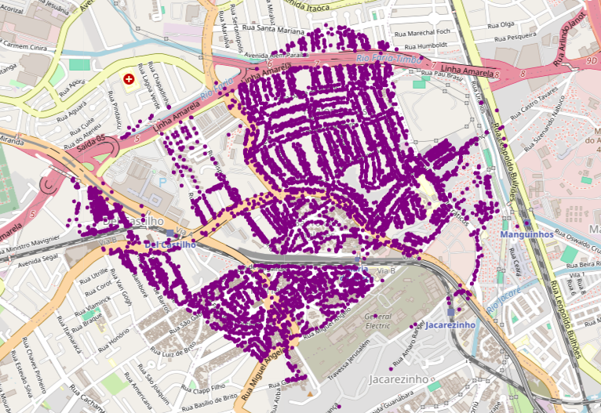
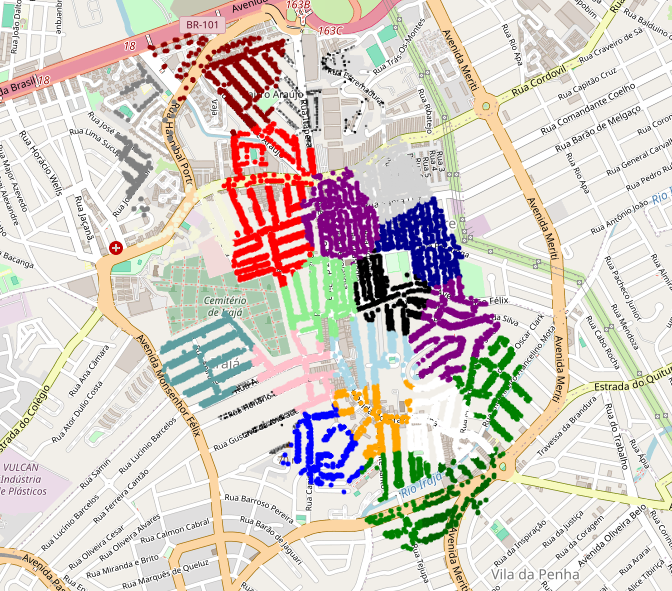
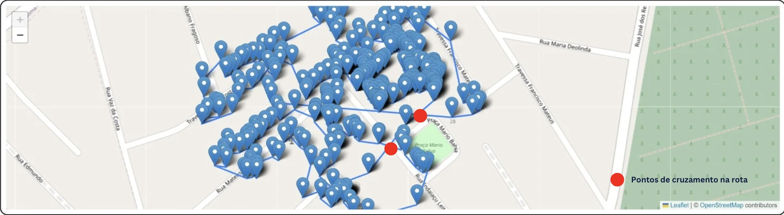
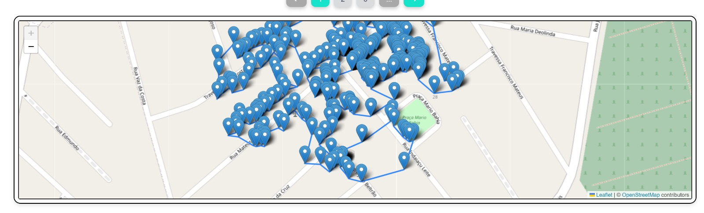

# Introdução

&emsp;&emsp;Este artigo propõe uma solução inovadora para a otimização das rotas de leitura de hidrômetros de consumo mensal, um desafio enfrentado pela Aegea Saneamento e Participações S.A., empresa líder no setor privado de saneamento básico no Brasil. Com uma ampla atuação em mais de 500 municípios, a Aegea busca constantemente melhorar a eficiência de seus processos, visando oferecer serviços de qualidade e contribuir para o bem-estar da população.

&emsp;&emsp;A leitura dos hidrômetros, que registra o consumo mensal de água dos clientes, é uma atividade essencial para a operação da Aegea. Entretanto, a complexidade desse processo, que envolve a elaboração de rotas para os leituristas, tem sido um desafio para a empresa. A necessidade de visitar milhões de ligações mensalmente, distribuídas em milhares de rotas, demanda uma abordagem otimizada para garantir a eficiência e a produtividade.

&emsp;&emsp;O objetivo deste estudo é desenvolver um otimizador que determine a melhor configuração de agrupamentos e sequenciamento das rotas de leitura. Através da consideração de variáveis como dias de leitura, horas de trabalho diárias, velocidade dos leituristas, número de leituristas e tempo de leitura, busca-se maximizar o número de leituras feitas em cada rota, ao mesmo tempo em que se minimiza a distância percorrida e o tempo de conclusão das rotas. Essa inclusão do número de leituristas como uma variável inputada no algoritmo permite realizar simulações mais precisas e adaptáveis às condições específicas de cada situação.

&emsp;&emsp;O problema em questão é similar ao do Problema do Caixeiro Viajante (PCV), porém com a diferença de que seriam vários caixeiros viajantes, os leituristas, responsáveis por visitar as diferentes ligações de forma otimizada. Um artigo que foi pego como referência neste estudo foi o trabalho realizado por Ferreira (2020) sobre a aplicação do PCV na otimização de rotas em uma concessionária de energia elétrica. Além disso, para compreender melhor os fundamentos do problema, também nos baseamos no estudo clássico de Gavish e Graves (1978) sobre o Problema do Caixeiro Viajante e problemas relacionados.

&emsp;&emsp;A implementação dessa solução proporcionará diversos benefícios para a Aegea, incluindo o aumento da taxa de entrega de contas e adimplência, o incremento da produtividade e efetividade da leitura, além da redução da quantidade de rotas e do tempo necessário para concluí-las. Essa abordagem não só contribuirá para a eficiência operacional da empresa, mas também para a satisfação dos clientes e para a construção de um ambiente sustentável.

&emsp;&emsp;É importante ressaltar que este estudo se baseia em técnicas avançadas de otimização e roteirização, adaptadas especificamente para as necessidades da Aegea. Ao explorar e desenvolver soluções inovadoras para desafios logísticos complexos, este trabalho visa não apenas resolver problemas imediatos, mas também estabelecer uma base sólida para futuras melhorias e inovações no setor de saneamento básico.

&emsp;&emsp;Ao longo deste artigo, serão discutidos detalhes sobre o problema em questão, a motivação do projeto, a metodologia proposta, os resultados obtidos e as considerações finais sobre a relevância desse estudo para a Aegea e para o setor de saneamento como um todo.

# Trabalhos relacionados

## 1° Trabalho: Ferreira, "Aplicação do PCV na otimização de rotas em uma concessionária de energia elétrica" (2020)

&emsp;&emsp;O estudo conduzido por Ferreira aborda a aplicação do Problema do Caixeiro Viajante (PCV) na otimização de rotas de leituristas em uma concessionária de energia elétrica. A pesquisa é relevante para o problema da Aegea, pois também lida com a necessidade de otimizar rotas para aumentar a eficiência operacional. Ferreira propõe um modelo que utiliza algoritmos de PCV para planejar rotas que minimizem a distância percorrida e o tempo de leitura, fatores cruciais também no contexto da leitura de hidrômetros. O estudo demonstra como técnicas avançadas de otimização podem ser adaptadas para diferentes setores, oferecendo uma base sólida para o desenvolvimento de soluções específicas para a Aegea.

## 2° Trabalho: Guimarães & Cunha, "Math-Heuristic for the Capacitated Two-Echelon Vehicle Routing Problem" (2023)

&emsp;&emsp;O artigo oferece uma abordagem valiosa para a otimização logística que pode ser aplicada ao problema da Aegea. A pesquisa propõe uma heurística matemática que combina técnicas de programação matemática com a meta-heurística Simulated Annealing para resolver o problema de roteirização de veículos capacitados em dois níveis (2E-CVRP). Este problema é relevante para a Aegea, pois envolve a otimização de rotas em uma rede de distribuição complexa, semelhante à distribuição de pontos de leitura de hidrômetros. A abordagem "cluster-first, route-second" descrita no artigo poderia ser adaptada para a criação de rotas eficientes para leituristas, agrupando pontos de leitura próximos antes de sequenciar as rotas. Os resultados experimentais demonstram que essa heurística pode gerar soluções iniciais de alta qualidade de forma rápida, o que é crucial para a operação eficiente da Aegea ao visitar milhões de ligações mensais distribuídas em milhares de rotas.

## 3° Trabalho: OptimoRoute, "Optimização de Rotas Utilizando Inteligência Artificial e Modelos Baseados em Regras" (2023)

&emsp;&emsp;A pesquisa analisa a implementação de modelos avançados de otimização de rotas que incorporam Inteligência Artificial (IA) e sistemas baseados em regras, focando em otimizar a eficiência em processos logísticos. A relevância desta pesquisa para o projeto é evidente, por abordar a otimização dinâmica de rotas em tempo real, uma capacidade crucial para melhorar a eficiência das operações de leitura de hidrômetros. Os modelos de IA, que aprendem continuamente com os dados históricos, são aplicados para ajustar as rotas com base em variáveis como tempo, distância e custo, proporcionando uma estrutura robusta que pode ser adaptada para otimizar as rotas de leitura na Aegea​.

## 4° Trabalho: Route Optimization Consultants, "Aplicações de Algoritmos de Otimização de Rotas em Serviços de Alta Densidade" (2023)

&emsp;&emsp;Este estudo explora algoritmos de otimização de rotas projetados especificamente para serviços de alta densidade como leituras de medidores e coletas de resíduos, onde muitas paradas são realizadas em áreas geográficas contíguas. A relevância deste trabalho para o projeto reside na sua abordagem de design de rota, que é essencial para a eficiência das operações de leitura de hidrômetros. Discutindo a importância da programação, limites geográficos e sequência das paradas, este estudo oferece _insights_ sobre como estruturar rotas que minimizem o tempo de deslocamento e custos operacionais, fornecendo uma base valiosa para otimizar as rotas da Aegea​.

# Resultados obtidos

&emsp;&emsp;Este projeto empregou diferentes abordagens para resolver o problema de otimização de rotas de leitura de hidrômetros na Aegea Saneamento e Participações S.A. A proposta de solução foi dividida em duas etapas: Clusterização e Percorrimento do algoritmo. A primeira etapa consistiu em agrupar os pontos de leitura em _clusters_, considerando a proximidade geográfica e a demanda de leitura. A segunda etapa envolveu a aplicação de algoritmos de otimização para determinar a melhor sequência de visitação dos _clusters_, levando em consideração variáveis como distância percorrida, tempo de leitura e horas de trabalho. 

## Dados utilizados

&emsp;&emsp;Os dados utilizados neste projeto consistem em informações geográficas de hidrômetros utilizados pela Aegea. Dessa forma, foi fornecido dois arquivos CSV, um com uma amostra menor de pontos de leitura no Rio de Janeiro (422 pontos) e outro arquivo com a amostra total de pontos de leitura (378.000 pontos). Esses dados foram utilizados para realizar a clusterização e o percorrimento das rotas.

## Resultados da clusterização

&emsp;&emsp;A clusterização foi implementada usando o algoritmo MiniBatchKMeans, uma escolha estratégica devido à sua capacidade de processar grandes volumes de dados de forma eficiente. O MiniBatchKMeans é uma variação do algoritmo KMeans que utiliza pequenos lotes (batches) de dados para atualizar os centróides dos _clusters_ em cada iteração, em vez de usar o conjunto de dados completo. Isso reduz significativamente a carga computacional e acelera o processo de clusterização, tornando-o ideal para problemas com grandes conjuntos de dados como o nosso.

&emsp;&emsp;Neste projeto, o MiniBatchKMeans foi configurado para agrupar 378.000 pontos de leitura de hidrômetros, considerando a proximidade geográfica e a demanda de leitura como critérios primários. Essa abordagem visa minimizar a distância total percorrida pelos leituristas e maximizar a eficiência das rotas. Como resultado da aplicação desse algoritmo, foi possível estabelecer 58 _clusters_ distintos de pontos de leitura. Cada agrupamento representa todos os pontos que um leiturista deve percorrer no mês, implicando a necessidade de 58 leituristas para cobrir todos os pontos eficientemente.

&emsp;&emsp;O processo de clusterização com o MiniBatchKMeans foi notavelmente rápido, completando a tarefa em apenas 2 minutos. Este tempo de execução reduzido é particularmente impressionante dado o alto número de pontos tratados e a complexidade inerente à distribuição geográfica dos hidrômetros. Esta eficiência demonstra a adequação do MiniBatchKMeans para resolver problemas de otimização de rotas em escalas extensas, proporcionando uma solução viável e rápida para a organização das rotas de leitura de hidrômetros.

Figura 01: Representação de um agrupamento

Fonte: Material desenvolvido pelos autores (2024)

&emsp;&emsp;A Figura 1 apresenta uma rota resultante do processo de clusterização em uma área específica, onde os pontos de leitura foram agrupados com base na proximidade geográfica. Cada ponto representa um hidrômetro que deve ser visitado pelo leiturista.

&emsp;&emsp;Após essa etapa, foi realizada uma segunda clusterização para dividir cada rota em 22 partes, correspondentes ao número de dias de trabalho do leiturista. Esse procedimento visa fracionar a rota total em rotas diárias mais gerenciáveis.

Figura 01: Representação de uma rota diária

Fonte: Material desenvolvido pelos autores (2024)

&emsp;&emsp;A Figura 2 apresenta as rotas diárias que foram definidas por meio da clusterização em uma área específica, onde cada cor representa uma rota diária dentro da rota maior, conforme apresentado na Figura 1.

&emsp;&emsp;Esta abordagem de clusterização permitiu uma distribuição eficiente dos pontos de leitura entre os leituristas, garantindo que cada rota fosse otimizada em termos de distância e tempo de execução. No entanto, observou-se que em determinados _clusters_ houve uma variação na densidade de pontos, com alguns possuindo mais pontos do que outros, o que pode resultar em variações na precisão dos resultados.

## Resultado do percorrimento

&emsp;&emsp;A etapa de percorrimento foi realizada com o objetivo de determinar a melhor sequência de visitação dos _clusters_, levando em consideração variáveis como distância, tempo e horas de trabalho. Para isso, após a clusterização, foram aplicados algoritmos de otimização nessas rotas, como o Algoritmo Nearest Neighbors (Raya e Saud, 2020) e o Two-Opt (Jaap, 2017), que buscam encontrar a solução ótima para o problema. Os resultados do percorrimento foram avaliados com base na distância total percorrida, no tempo de conclusão das rotas e no tempo de execução.

&emsp;&emsp;Para a execução dos algoritmos, foi necessário definir as restrições de roteirização, para que os algoritmos encontrassem rotas sem violá-las. As restrições definidas incluíram: tempo máximo de trabalho diário, dias totais de trabalho e tempo de leitura em cada hidrômetro. Nos nossos testes, foi estabelecido um tempo máximo de trabalho diário de 6 horas, 22 dias de trabalho e 1 minuto de leitura em cada hidrômetro. Essas restrições foram fundamentais para garantir que as rotas fossem otimizadas de acordo com as condições reais de trabalho dos leituristas.

&emsp;&emsp;Inicialmente, o percorrimento foi realizado apenas com o algoritmo heurístico Nearest Neighbors, que consiste em visitar o vértice mais próximo do ponto atual em cada iteração, possuindo uma complexidade de $O(n^2)$, onde $n$ é o número de pontos. Esse algoritmo é eficiente para encontrar soluções iniciais, mas pode não garantir a solução ótima. Como resultado, o Nearest Neighbors demorou aproximadamente 2 horas para realizar a roteirização de todos os _clusters_ da amostra total, que possui 378.000 pontos. A Figura 3 apresenta um exemplo de uma rota diária gerada pelo algoritmo Nearest Neighbors, onde a sequência de visitação dos _clusters_ é determinada com base na proximidade geográfica.

Figura 03: Rota gerada pelo algoritmo Nearest Neighbors

Fonte: Material desenvolvido pelos autores (2024)

&emsp;&emsp;No entanto, ao observar a rota criada na figura 3, é possível observar que houve cruzamentos, evidenciados pelos pontos vermelhos na imagem. Essas travessias acaba gerando uma rota menos eficiênte e com um uma distância total maior.

&emsp;&emsp;Dessa forma, para resolver o problema dos cruzamentos, foi aplicado o algoritmo Two-Opt, que aperfeiçoa a rota inicialmente gerada pelo Nearest Neighbors, realizando trocas entre os pontos de leitura para minimizar a distância total percorrida. O Two-Opt é um algoritmo de busca local que visa reduzir o custo total da rota. Ele funciona trocando sequencialmente os vértices para reduzir a distância total e eliminar cruzamentos entre as rotas. Este algoritmo tem uma complexidade de $O(n^2 \cdot k)$, onde $n$ representa o número de pontos e $k$ o número de iterações necessárias até a convergência.

&emsp;&emsp;Combinando os algoritmos Nearest Neighbors e Two-Opt, a execução total durou aproximadamente 4 horas, utilizando a amostra total com uma média de 324 pontos visitados por _cluster_ diário. A Figura 4 ilustra a mesma rota diária apresentada na Figura 3, porém otimizada pelo Two-Opt. As modificações realizadas resultaram em uma redução significativa tanto na distância total percorrida quanto nos cruzamentos em relação à rota originalmente gerada pelo Nearest Neighbors.

Figura 04: Rota gerada pelo algoritmo Nearest Neighbors com Two-Opt

Fonte: Material desenvolvido pelos autores (2024)

&emsp;&emsp;Os resultados obtidos com a aplicação do algoritmo Two-Opt otimizando o Nearest Neighbors demonstraram uma redução significativa na distância total percorrida e no tempo de conclusão das rotas em comparação com a rota gerada pelo Nearest Neighbors sozinho. Essa otimização permitiu uma distribuição mais eficiente dos pontos de leitura entre os leituristas, resultando em rotas mais curtas e tempo de execução reduzido. Além disso, o algoritmo Two-Opt foi capaz de evitar cruzamentos entre as rotas, o que é crucial para garantir a eficiência e a produtividade dos leituristas.

&emsp;&emsp;O emprego de técnicas de otimização avançadas, como demonstrado neste estudo, ilustra o potencial de aplicação prática dessas metodologias em larga escala. As estratégias implementadas podem ser adaptadas e replicadas em outras operações da Aegea em diferentes regiões, sugerindo um modelo robusto para o planejamento estratégico de operações logísticas em larga escala.

# Conclusão

&emsp;&emsp;O projeto apresenta um progresso notável na otimização das rotas de leitura de hidrômetros na Aegea. Destacando a aplicabilidade prática e o impacto significativo dos algoritmos de otimização e técnicas de roteirização avançadas. A implementação bem-sucedida do MiniBatchKMeans e a combinação dos algoritmos Nearest Neighbors e Two-Opt demonstram uma abordagem inovadora e altamente eficiente para lidar com os desafios logísticos associados à leitura de hidrômetros em larga escala.

&emsp;&emsp;Os desafios enfrentados neste projeto, particularmente na manipulação e análise de grandes volumes de dados geográficos, não apenas validaram a eficácia da solução proposta, mas também impulsionaram a capacidade de inovação e adaptação. A colaboração contínua com os __stakeholders_ foi essencial para garantir que a solução estivesse alinhada com as necessidades operacionais e estratégicas da Aegea, sublinhando a importância da cooperação e do diálogo no sucesso de iniciativas tecnológicas complexas.

&emsp;&emsp;Olhando para o futuro, o potencial de aplicação das metodologias e algoritmos utilizados neste projeto em outras operações é imenso. A versatilidade das técnicas de otimização e roteirização empregadas pode transformar não apenas a eficiência operacional, mas também a tomada de decisões em várias áreas da empresa, reforçando a importância da tecnologia como um pilar essencial para a competitividade no setor de saneamento. Além disso, a disseminação desses conhecimentos e práticas tem o potencial de inspirar soluções semelhantes em outras empresas do setor, contribuindo para uma mudança positiva e sustentável na indústria de saneamento.

&emsp;&emsp;Para garantir que trabalhos futuros continuem a expandir e aprimorar o que foi estabelecido no artigo, sugere-se as seguintes direções de pesquisa e desenvolvimento:

- **Expansão para outras regiões e setores:** Testar e adaptar o modelo de otimização para outras regiões e diferentes contextos dentro da Aegea, ou até mesmo em outras empresas do setor de saneamento e serviços públicos, para validar a universalidade e a eficácia das técnicas desenvolvidas.
- **Modelagem de Incertezas:** Incorporar modelagem de incertezas relacionadas a fatores externos, como tráfego e condições climáticas, para tornar o sistema de otimização mais robusto e adaptável a variações inesperadas.
- **_Feedback_ Contínuo e Aprendizado Adaptativo:** Implementar sistemas de _feedback_ contínuo que coletam dados operacionais em tempo real para ajustar e melhorar os modelos de roteirização.
- **Integração de Novas Tecnologias:** Explorar a integração de tecnologias emergentes, como aprendizado de máquina e Internet das Coisas (IoT), para aprimorar ainda mais a precisão e eficiência das rotas de leitura.

### Considerações finais e projeções futuras:
1. **Colaboração e Comunicação:** A interação constante com os _stakeholders_ e a colaboração entre as equipes foram fundamentais para o alinhamento do projeto desenvolvido.
2. **Projeções Futuras:** Expandir o uso do algoritmo de otimização para outras áreas da empresa, para maximizar a eficiência operacional em toda a empresa.
3. **Expansão e Escalabilidade:** Um projeto bem desenvolvido abre caminhos para a sua expansão e aplicação em outras áreas.
4. **Desenvolvimento profissional:** Incentivou a formação de uma força de trabalho para enfrentar futuros desafios.

&emsp;&emsp;Diante dessas considerações, a conclusão deste estudo marca uma etapa significativa na abordagem interdisciplinar à otimização de processos logísticos na Aegea Saneamento. A combinação de conhecimento técnico e uma compreensão profunda das operações possibilitou a aplicação eficaz de métodos avançados de otimização, pavimentando o caminho para práticas de gestão mais ágeis e sustentáveis. O projeto não apenas evidenciou como inovações metodológicas, respaldadas por uma base teórica sólida, podem levar a melhorias significativas na eficiência e na sustentabilidade operacional, mas também abriu um leque de possibilidades para que essas técnicas sejam adaptadas e replicadas em outros setores ou regiões. Assim, essa jornada de inovação não apenas atendeu às demandas da Aegea, mas também preparou o terreno para futuras adaptações e melhorias, reforçando a importância de soluções tecnológicas avançadas na transformação contínua da indústria de saneamento e além.

# Referências Bibliográficas

- Ferreira, I. A. (2020). Traveling Salesman: Applying Mathematical Modeling in the Optimization of Routes in a Concessionary of Electrical Energy. João Pessoa, PB: Universidade Federal da Paraíba (UFPB). Disponível em: https://www.producaoonline.org.br/rpo/article/view/3491/1894. Acesso em: 3 de maio de 2024.

- Gavish, B.; Graves, S. C. (1978). The Travelling Salesman Problem and Related Problems. Massachusetts: Massachusetts Institute of Technology. Technical Report 078-78. Disponível em: https://dspace.mit.edu/bitstream/handle/1721.1/5363/OR-078-78.pdf?sequence=1&isAllowed=y  Acesso em: 3 de maio de 2024.

- Guimarães, J. C. F., & Cunha, C. B. (2023). Math-Heuristic for the Capacitated Two-Echelon Vehicle Routing Problem. Pesquisa Operacional. Disponível em: https://www.scielo.br/j/pope/a/jLxGFhtmNfcnDxT38VRDctp/?format=pdf&lang=en. Acesso em: 20 de maio de 2024

- OptimoRoute. (2023). An Overview of Route Optimization Techniques. Disponível em: https://www.optimoroute.com/route-optimization-techniques/. Acesso em: 20 de maio de 2024.

- Route Optimization Consultants. (2023). Route Optimization Software Algorithms Defined. Disponível em: https://routeoptimizationconsultants.com/routing-software/route-optimization-algorithms/. Acesso em: 21 de maio de 2024.

- Uddin, F. et al. (2023). An improvement to the 2-Opt heuristic algorithm for approximation of optimal TSP tour. Disponível em: https://www.mdpi.com/2076-3417/13/12/7339#:~:text=The%202%2DOpt%20algorithm%20removes,%3B%20otherwise%2C%20it%20is%20rejected. Acesso em: 9 de junho de 2024.

- Jaap J. A. Slootbeek. (2017). Average-Case Analysis of the 2-opt Heuristic for the TSP. Disponível em: https://essay.utwente.nl/72060/1/Slootbeek_MA_EEMCS.pdf. Acesso em: 18 de junho de 2024.

- Lilysuriazna Raya & Safaa N. Saud. (2020). A Comparative Study Between The Nearest-Neighbour Algorithm And Its Variants For Solving The Euclidean Traveling Salesman Problem. Disponível em: https://archives.palarch.nl/index.php/jae/article/download/4743/4699/9169. Acesso em: 18 de junho de 2024.
