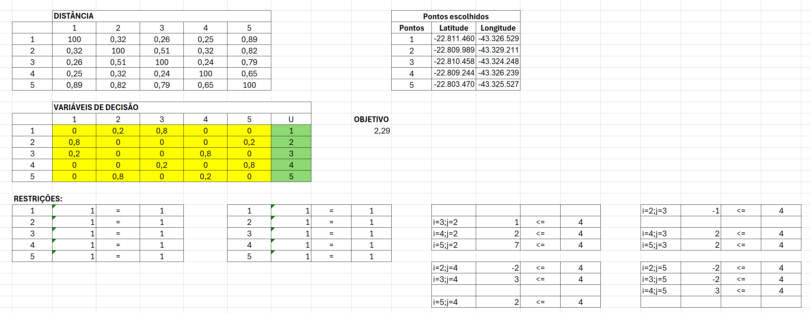
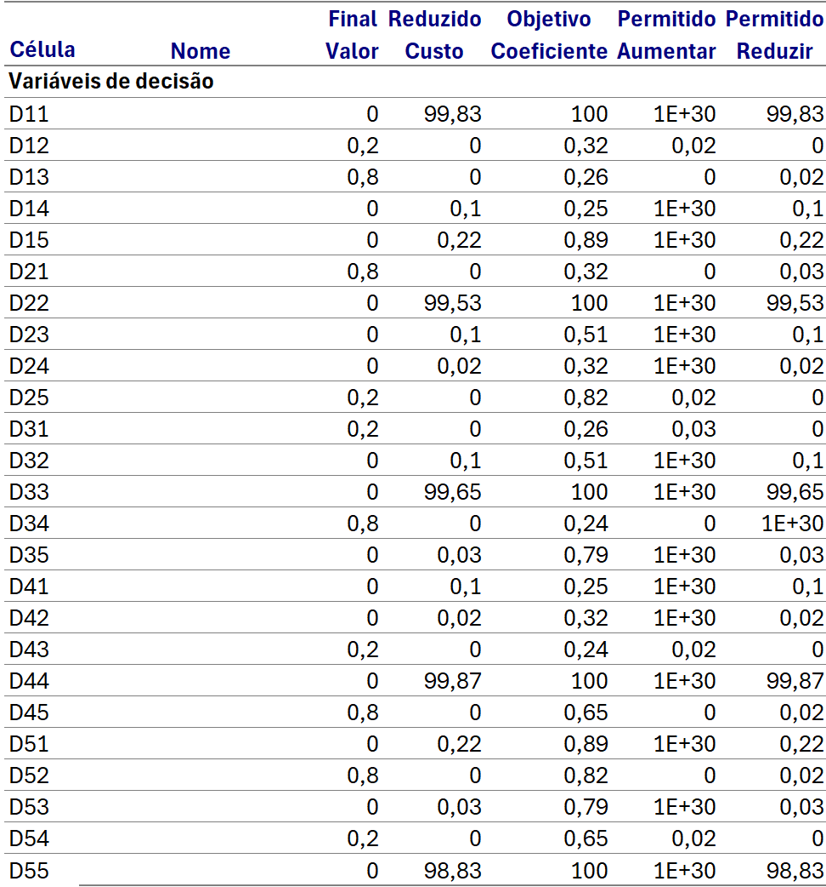

# Entendimento do contexto do problema: modelagem e representação

## 1. Contexto do problema a ser resolvido

&emsp;&emsp;O problema proposto pela Aegea visa aprimorar as rotas de leitura de hidrômetros de consumo mensal, uma atividade crucial para garantir a eficácia das operações da empresa. Com mais de 1,6 milhões de ligações lidas mensalmente apenas pela concessionária Águas do Rio, a eficiência na execução dessas rotas é essencial. O desafio consiste em desenvolver um algoritmo que determine a melhor configuração de agrupamentos e sequenciamento das ligações, levando em conta variáveis como o número de dias de leitura, horas de trabalho diárias e a velocidade do leiturista. É crucial também considerar premissas como a minimização das travessias de ruas para reduzir riscos de acidentes, a necessidade de que todas as rotas possam ser percorridas por caminhos factíveis, e a obrigatoriedade de visitar todas as ligações dentro do intervalo estabelecido de dias de leitura. Dessa forma, a solução visa aprimorar a produtividade e efetividade do processo de leitura, reduzindo simultaneamente o número de rotas e o tempo entre leituras.

## 2. Dados disponíveis

&emsp;&emsp;Os dados disponibilizados para análise consistem em dois arquivos CSV fornecidos pela Aegea. O primeiro arquivo contém uma amostra total dos pontos de leitura de hidrômetros, enquanto o segundo arquivo representa uma amostra menor, abrangendo uma área específica do Rio de Janeiro, que será o foco do nosso trabalho.

&emsp;&emsp;Cada arquivo possui sete colunas de dados:

1. Índice: Identificador único para cada ponto de leitura.
2. Latitude: Coordenada geográfica que indica a posição do ponto no eixo vertical.
3. Longitude: Coordenada geográfica que indica a posição do ponto no eixo horizontal.
4. Código da Rota: Identificação da rota à qual o ponto de leitura pertence.
5. Sequência: Indicação da ordem de visita do ponto dentro da rota.
6. Logradouro: Nome da rua ou avenida onde o ponto está localizado.
7. Número: Número do endereço onde o ponto está localizado.

&emsp;&emsp;O arquivo da amostra menor possui aproximadamente 6080 linhas, representando uma parcela dos pontos de leitura da Aegea na região delimitada do Rio de Janeiro. Esses dados serão utilizados para desenvolver e testar o algoritmo de otimização das rotas de leitura de hidrômetros, visando melhorar a eficiência operacional da empresa.

&emsp;&emsp; Além disso, foi fornecido um arquivo TXT com as coordenadas geográficas das bases operacionais da Aegea, que representam os locais onde os leituristas iniciam e encerram suas atividades diárias.

## 3. Objetivo do problema

&emsp;&emsp;A função objetivo do problema apresentado é minimizar a distância total percorrida por rota para cada um dos leituristas. Isso é alcançado ao calcular a soma das distâncias de todas as arestas que conectam os clientes na rota percorrida. Ao minimizar essa soma, o objetivo é encontrar a rota mais curta possível que visite cada cliente exatamente uma vez e retorne ao ponto de origem.

## 4. Limitações do problema

&emsp;&emsp;As limitações do problema incluem os seguintes aspectos:

- O leiturista deve chegar em cada cliente exatamente uma vez;
- O leiturista deve sair de cada cliente exatamente uma vez;
- Eliminação de sub-rotas, evitando a formação de ciclos dentro das rotas, garantindo que cada cidade seja visitada uma única vez na solução do problema.

&emsp;&emsp;Essas limitações devem ser consideradas durante a modelagem matemática do problema, garantindo que as soluções encontradas sejam viáveis dentro desses parâmetros estabelecidos.

## 5. Expressões matemáticas do problema

&emsp;&emsp;Para abordar a otimização das rotas de leitura de hidrômetros, utilizaremos um modelo matemático baseado no Problema do Caixeiro Viajante (TSP), adaptado para incorporar múltiplas rotas e restrições específicas de tempo e distância. A seguir, detalhamos os índices, parâmetros, variáveis de decisão, a função objetivo e as restrições do modelo.

### Índices
* $i,j:$ Índices que representam os pontos de leitura de hidrômetros dos clientes, onde $i,j=1,2,...,n$ e $i \neq j$.

Estes índices são utilizados para identificar cada ponto de leitura único no conjunto de dados e para representar suas interações na matriz de distâncias e decisões de rota.

### Parâmetros

* $d_{ij}:$ Distância euclidiana entre os pontos de leitura $i$ e $j$. Estas distâncias são calculadas com base nas coordenadas geográficas (latitude e longitude) de cada ponto. 

* N: Número total de clientes (pontos de leitura) envolvidos na rota de leitura.

### Variáveis de decisão

$$x_{ij} = 
\begin{cases} 
1, & \text{se o arco } (i, j) \text{ for utilizado} \\
0, & \text{caso contrário} 
\end{cases}$$

* $x_{ij}:$ Variável binária que indica se o leiturista irá se deslocar do ponto de leitura $i$ para o ponto de leitura $j$ na rota. Se $x_{ij}=1$, o leiturista irá se deslocar do ponto $i$ para o ponto $j$; se $x_{ij}=0$, o leiturista não irá se deslocar do ponto $i$ para o ponto $j$.

  
### Função objetivo

* **Minimizar o custo total de deslocamento:**

$$ \text{Min} \quad Z = \sum_{i=1}^{N} \sum_{j=1}^{N},  \_{j \neq i} d_{ij} \cdot x_{ij} $$

#### Componentes da função objetivo:

1. Símbolo de Minimização (Min): Indica que o objetivo é minimizar a função. Neste caso, o objetivo é reduzir ao mínimo o custo total de deslocamento, representado por $Z$.

2. Custo Total de Deslocamento ($Z$): É a variável que representa o custo total de deslocamento para todas as rotas consideradas. É a soma de todos os custos individuais de deslocamento entre pontos de leitura consecutivos em uma rota.
   
3. Somatória dupla ($\sum_{i=1}^{N} \sum_{j=1}^{N}, _{j \neq i}$): Indica que a função objetivo deve considerar todas as combinações possíveis de pontos de leitura, exceto quando $i=j$ (ou seja, o leiturista não se desloca do ponto $i$ para o mesmo ponto $j$).

4. Distância Euclidiana entre Pontos de Leitura ($d_{ij}$): Representa a distância euclidiana entre os pontos de leitura $i$ e $j$. Essas distâncias são calculadas com base nas coordenadas geográficas (latitude e longitude) de cada ponto, usando a fórmula de Haversine.
5. Variável de Decisão ($x_{ij}$): Indica se o leiturista irá se deslocar do ponto de leitura $i$ para o ponto de leitura $j$ na rota.

### Restrições

1. **Restrição de saída de cada cliente** (visitando cada cliente uma vez):
Garante que cada cliente $i$ seja o ponto de partida para exatamente uma ligação.
$$\sum_{j=1, j \neq i}^{N} x_{ij} = 1 \quad \forall i$$

* Esta é uma somatória que percorre todos os possíveis destinos $j$ para um ponto de partida $i$, excluindo a possibilidade de $i$ se ligar a si mesmo ($j \neq i$).

* $=1$: O resultado da somatória deve ser igual a $1$, o que significa que existe exatamente um e somente um deslocamento saindo de cada ponto $i$. Isso evita que um ponto seja omitido ou visitado mais de uma vez como ponto de partida.

2. **Restrição de entrada para cada cliente** (cada cliente é visitado uma vez):
Assegura que cada cliente $j$ seja o ponto de chegada para exatamente uma ligação.

$$\sum_{i=1, i \neq j}^{N} x_{ji} = 1 \quad \forall j
$$

* Esta é uma somatória que percorre todos os possíveis pontos de partida $i$ para um destino $j$, excluindo a possibilidade de $j$ se ligar a si mesmo ($i \neq j$).
* $=1$: O resultado da somatória deve ser igual a $1$, o que significa que existe exatamente um e somente um deslocamento chegando a cada ponto $j$. Isso evita que um ponto seja omitido ou visitado mais de uma vez como ponto de chegada.

 
&emsp;&emsp;**Restrições de Subciclos (Eliminação de Subciclos)**:
Uma das principais questões em problemas do tipo TSP é a formação de subciclos, que devem ser evitados para garantir que a solução forme um único ciclo que inclua todos os pontos de leitura. Uma forma comum de lidar com isso é através das restrições de Miller-Tucker-Zemlin (MTZ):

3. **Eliminação de subciclos (MTZ):** Utiliza variáveis sequenciais $S_i$ para evitar ciclos menores dentro da solução principal.

$$s_i - s_j + N x_{ij} \leq N - 1 \quad \forall i, j = 2, \dots, N; i \neq j
$$

* $s_i$ e $s_j$ são variáveis sequenciais que representam a ordem de visita dos pontos de leitura $i$ e $j$.

* $N_{x_{ij}}$ é o número total de pontos de leitura, que é utilizado para garantir que esta restrição seja relevante apenas quando $x_{ij} = 1$ (ou seja, quando o ponto $i$ é seguido pelo ponto $j$ na rota).

* $\leq N-1:$ A condição estabelece que a posição sequencial de $i$ deve ser sempre menor que a de $j$, corrigida por $N-1$, se $i$ precede $j$ diretamente na rota, prevenindo ciclos menores e isolados dentro da solução global.

&emsp;&emsp;Estas restrições são cruciais para assegurar que a solução do problema de otimização não apenas minimize a distância total percorrida, mas também respeite os requisitos logísticos e operacionais do processo de leitura de hidrômetros. Elas garantem a viabilidade e integridade das rotas, facilitando a aplicação prática do modelo na operação real da Aegea Saneamento.

## 6. Análise de sensibilidade

&emsp;&emsp;No processo de otimização das rotas de leitura de hidrômetros, a análise de sensibilidade desempenha um papel crucial, permitindo examinar a robustez e a estabilidade das soluções propostas diante de variações nos parâmetros do problema. Para essa análise, foram selecionados aleatoriamente cinco pontos da base de dados fornecida pela Aegea, representando diferentes locais de leitura de hidrômetros. Utilizando uma abordagem de modelagem matemática implementada no Excel e resolvida pelo método do Simplex no Solver, foram obtidos resultados que, embora possam conter valores fracionários devido às nuances do problema, ainda oferecem _insights_ significativos. Para gerar o relatório de sensibilidade, foi implementado no Excel o seguinte modelo:

 

   <b>Figura 1 -</b> Modelagem matemática no Excel

   

      </a>
   

   Fonte: Material desenvolvido pelos autores (2024)

 

&emsp;&emsp;Na análise de sensibilidade, um dos aspectos cruciais a serem examinados é a coluna de custo reduzido no relatório gerado pelo Solver. Essa coluna indica o quanto a distância total percorrida seria afetada se o coeficiente associado a uma variável de decisão mudasse marginalmente. Em outras palavras, ela mostra o quanto a distância percorrida aumentaria se uma determinada variável, como a inclusão de uma rota, fosse ajustada em uma pequena quantidade. Ao interpretar os valores na coluna de custo reduzido, é possível entender quais variáveis têm maior impacto na distância total percorrida e, consequentemente, nas rotas propostas. Essa análise fornece _insights_ valiosos sobre quais ajustes podem ser feitos para otimizar ainda mais as rotas, identificando áreas específicas que podem ser refinadas para melhorar a eficiência operacional e logística da empresa. Após executar o Solver no Excel para o problema descrito anteriormente, foi gerado o seguinte relatório de sensibilidade:

 

   <b>Figura 2 -</b> Relatório de sensibilidade 

   

      </a>
   

   Fonte: Material desenvolvido pelos autores (2024)

 

&emsp;&emsp;Focando no relatório de sensibilidade apresentado acima, na coluna de valor final, os valores que diferem de zero indicam que estão presentes na solução que minimiza a função objetivo, e por isso seus valores na coluna de custo reduzido são iguais a zero, pois já estão incluídos na solução. Por outro lado, os valores iguais a zero na coluna de valor final não estão presentes na solução. Portanto, seus valores na coluna de custo reduzido representam o quanto a distância total percorrida aumentaria caso algum desses coeficientes não fosse igual a zero, ou seja, se fossem incluídos na solução.

&emsp;&emsp;Em relação aos números consideravelmente maiores que os outros na coluna de custo reduzido, como 99, eles são tão maiores porque estão relacionados às distâncias entre os mesmos pontos. Por exemplo, D11 é a distância do ponto 1 para o ponto 1. Caso essa variável fosse incluída na solução, a função objetivo teria um aumento significativo. Isso ocorre porque, na modelagem do Excel, mais especificamente na tabela das distâncias, todos os pontos onde i = j têm suas distâncias deliberadamente definidas como consideravelmente maiores do que as outras. Isso é feito para garantir que o Solver, ao resolver, não procure a rota de um ponto para ele mesmo, respeitando assim as restrições do problema.

## 7. Referências

FERREIRA, Ivanilda Agustinho. Caixeiro Viajante: Aplicação da Modelagem Matemática na Otimização de Rotas em uma Concessionária de Energia Elétrica. Revista Produção Online, Florianópolis, v. 20, n. 1, p. 221-246, 2020. Disponível em: [Produção Online](https://www.producaoonline.org.br/rpo/article/view/3491/1894). Acesso em: 23 de Abr. de 2024.

