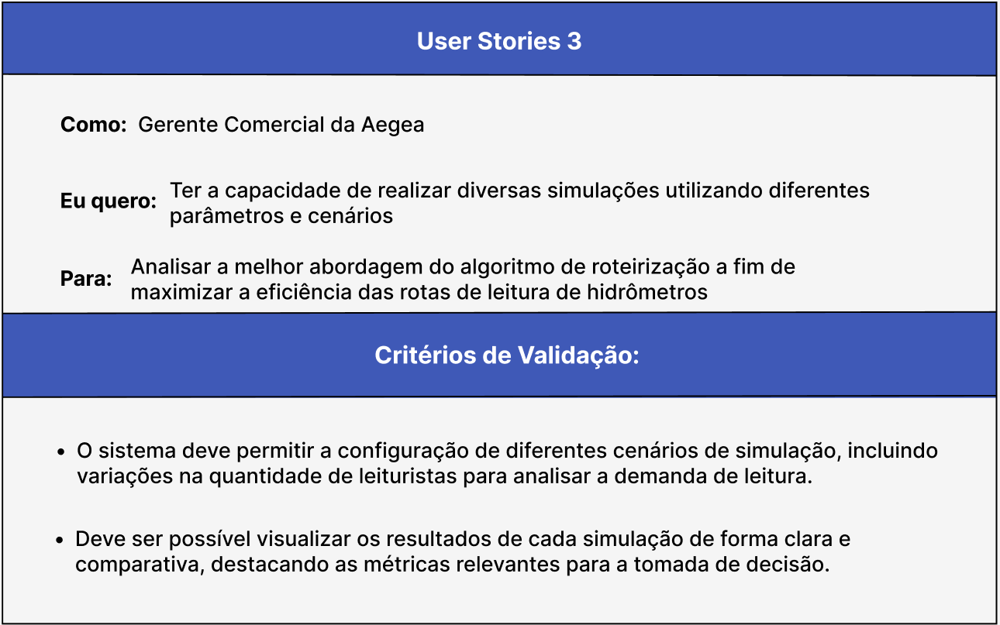
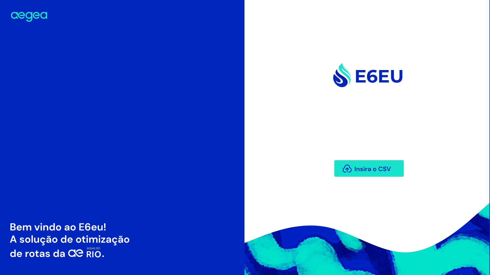
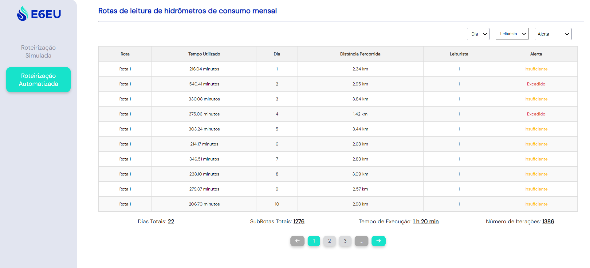

# Entendimento da Experiência do Usuário

## 1. Persona - Gerente Comercial da Águas do Rio

&emsp;&emsp;Dentro do contexto empresarial, uma persona representa uma idealização de um usuário, fundamentada em dados concretos acerca dos comportamentos e demandas reais dos clientes [1]. No âmbito do projeto de Otimização de Rotas para Leitura de Hidrômetros Mensais, a definição dessa persona é essencial para uma compreensão abrangente das necessidades, desafios e preferências dos usuários finais. A seguir, apresentamos a persona selecionada para representar o principal usuário da solução desenvolvida pela equipe **E6eu**.

 

   <b>Figura 1 -</b> 1° Mapa de Persona: Pedro Sales

   

      </a>
   

   Fonte: Material desenvolvido pelos autores (2024)

 

 

   <b>Figura 2 -</b> 2° Mapa de Persona: Pedro Sales

   

      </a>
   

   Fonte: Material desenvolvido pelos autores (2024)

 

## 1.1 Informações Gerais:

* Gênero: Masculino
* Localização: Rio de Janeiro - RJ
* Formação: Graduado em Administração de Empresas
* Ocupação: Gerente Comercial da Águas do Rio

## 1.2 Biografia

&emsp;&emsp;Com mais de uma década de experiência em Saneamento, Pedro Sales, graduado em Administração, lidera equipes em diversas áreas, incluindo planejamento, operações, medição, faturamento e recadastramento de clientes. Utilizando estudos econômico-financeiros, mapeamento cartográfico, contratos de _performance_ e tecnologias como IA (Inteligência Artificial) e drones, o trabalho dele possibilita o aprimoramento dos processos existentes. Como Gerente Comercial na concessionária da Aegea, Águas do Rio, ele contribui para o acesso da população a serviços de saneamento básico de alta qualidade, com eficiência econômica e compromisso ambiental, promovendo a saúde pública e o desenvolvimento sustentável da região.

### 1.2.1. Importância da Persona

&emsp;&emsp;A persona desenvolvida, Pedro Sales, desempenha um papel crucial como usuário final da solução de otimização de rotas para leitura de hidrômetros. Com sua vasta experiência no setor de saneamento, Pedro lidera equipes responsáveis por assegurar a eficiência e a qualidade dos serviços oferecidos à população. Embora os leituristas também desempenhem um papel significativo neste processo, é Pedro quem está na linha de frente da gestão, planejamento e tomada de decisões estratégicas para a empresa, fazendo dele um usuário-chave para a solução proposta.

&emsp;&emsp;Essa abordagem não apenas atende às necessidades imediatas da equipe comercial, gerenciada por Pedro, mas também contribui para o progresso do setor de saneamento como um todo, oferecendo benefícios tangíveis para a empresa e para a comunidade que ela serve. O acesso ao saneamento básico é um direito humano fundamental e um determinante crucial para a saúde e o bem-estar das pessoas [2], destacando ainda mais a importância do trabalho de Pedro e sua equipe. Portanto, a persona de Pedro Sales desempenha um papel essencial na compreensão da experiência do usuário e no desenvolvimento de uma solução eficaz e impactante para a Águas do Rio.

### 1.3 Dores, Necessidades e Desejos:

#### 1.3.1. Dores

&emsp;&emsp;Pedro está em busca de soluções para reduzir custos e atribuir novas responsabilidades aos aproximadamente 400 leituristas da Águas do Rio. No entanto, o tempo desses profissionais é mal empregado devido à falta de um modelo de rota eficiente, visto que, atualmente, as rotas são definidas através do GIS (Sistema de Informação Geográfica), entretanto, as 4.000 rotas herdadas da antiga concessionária na região do Rio de Janeiro que não foram otimizadas adequadamente, além de sobreposições de endereços em várias rotas, gerando retrabalho e aumentando o tempo de leitura [3]. Ademais, o extenso dimensionamento da cidade do Rio de Janeiro resulta em trajetos complexos, que incluem a necessidade de travessias de pontes entre pontos de leitura, aumentando os custos operacionais e o risco de acidentes.

&emsp;&emsp;O investimento considerável de R$39 bilhões [4] por parte da Aegea apenas na unidade do Rio torna qualquer atraso na leitura dos hidrômetros uma questão financeira crítica. Isso pode levar ao aumento do prazo de vencimento das faturas e à exclusão do faturamento do caixa da empresa por até três dias, impactando diretamente na arrecadação e na gestão financeira. Essa situação compromete diretamente a qualidade dos serviços oferecidos pela equipe liderada por Pedro Sales aos clientes. Por fim, o custo de cada leiturista é de aproximadamente R$6.000,00 por mês, incluindo salário, encargos e benefícios, além do investimento em CAPEX (_Capital Expenditure_)[5] para aquisição de equipamentos e tecnologias necessárias para a leitura dos hidrômetros, como _smartphones_, impressoras térmicas e bobinas de papel. Isso faz com que a otimização das rotas seja uma prioridade para Pedro Sales e sua equipe.

#### 1.3.2. Necessidades:

1. Padronize as leituras dos hidrômetros;
2. Forneça a rota de leitura otimizada e que leve em consideração parâmetros como tempo, distância percorrida, quantidade de clientes por rota e etc;
3. Todas as ligações devem ser visitadas dentro do intervalo de dias de leitura e devem começar e terminar no mesmo dia;
4. Em todas as rotas deve ser possível ir de um ponto ao outro através de um caminho factível de ser percorrido;
5. Deve-se minimizar a quantidade de vezes que os leituristas cruzam ruas.
6. Adicionalmente, em endereços com múltiplos hidrômetros, os leituristas precisam ser capazes de identificar com clareza qual hidrômetro deve ser lido primeiro, a fim de garantir que os dados sejam passados para o sistema de faturamento corretamente;
  
#### 1.3.3. Desejos

&emsp;&emsp;O gerente comercial deseja reduzir os custos operacionais e promover a eficiência nas operações, ao mesmo tempo em que busca uma abordagem inovadora e escalável que possa modernizar as práticas do setor de saneamento e proporcionar uma vantagem competitiva significativa para a Aegea.

&emsp;&emsp;De modo geral, Pedro está em busca de um **otimizador de rotas**, capaz de estabelecer a configuração ideal de agrupamentos e sequenciamento. Sua expectativa é que essa ferramenta consiga traçar as rotas de leitura de hidrômetros de maneira eficiente, garantindo que todos os clientes sejam atendidos dentro de um prazo máximo de **22 dias** de leitura. 

&emsp;&emsp;Ele também espera que o otimizador respeite o limite de **6 horas diárias** para cada rota, considerando a velocidade de deslocamento dos leituristas, que é de **5 km/h**, e o tempo médio de leitura em cada visita, que é de **2 minutos**. Dessa forma, Pedro busca otimizar o processo de leitura de hidrômetros, garantindo eficiência e cumprimento dos prazos estabelecidos. Embora não o considere uma necessidade essencial, Pedro Sales vê como uma vantagem significativa a capacidade da solução proposta de gerar um painel visual com a configuração espacial das rotas. Esse recurso facilitaria a visualização e o acompanhamento das atividades de leitura, agregando valor ao processo operacional.

## 1.4 Cenários de Interação

&emsp;&emsp;Atualmente, Pedro Sales utiliza o GIS (Sistema de Informação Geográfica) para visualizar as rotas de leitura de hidrômetros já existentes. No entanto, transforma a representação visual das rotas em planilhas, utilizando o Excel, que são posteriormente enviadas para os _smartphones_ dos leituristas.

## 1.5 Nível de Letramento Digital

&emsp;&emsp;Pedro Sales possui um alto nível de letramento digital, fundamentado em sua vasta experiência e conhecimento em tecnologias avançadas aplicadas ao setor de saneamento. Sua habilidade em utilizar ferramentas digitais e tecnológicas, como IA e drones, evidencia sua capacidade de compreender, analisar e implementar soluções inovadoras para otimizar processos e melhorar a eficiência operacional.

## 1.6 Citações Diretas

&emsp;&emsp;"Reduzir os custos operacionais e promover a eficiência nas operações é crucial para o nosso trabalho na Águas do Rio. Buscamos uma abordagem inovadora e escalável que possa modernizar as práticas do setor de saneamento e proporcionar uma vantagem competitiva significativa para a Aegea." - Pedro Sales (Gerente Comercial da Águas do Rio)

&emsp;&emsp;"Estamos em busca de um otimizador de rotas capaz de estabelecer a configuração ideal de agrupamentos e sequenciamento. Esperamos que essa ferramenta consiga traçar as rotas de leitura de hidrômetros de maneira eficiente, garantindo que todos os clientes sejam atendidos dentro de um prazo máximo de 22 dias de leitura." - Pedro Sales (Gerente Comercial da Águas do Rio)

## 2. _User Stories_

### 2.1. Introdução:

&emsp;&emsp;_User Stories_ constituem-se como uma metodologia eficaz no âmbito do desenvolvimento ágil de _softwares_, caracterizando-se pela concisão e clareza na expressão das necessidades dos usuários. Essas narrativas são estruturadas seguindo um modelo padrão: "Como [perfil do usuário], desejo [funcionalidade] para [objetivo ou benefício]". Tal formato propicia uma perspectiva centrada no usuário, incentivando o desenvolvimento orientado por resultados específicos e valor agregado. Além disso, são acompanhadas por critérios de aceitação, os quais delimitam as condições necessárias para que a funcionalidade proposta seja considerada satisfatória.

&emsp;&emsp;No contexto do desenvolvimento ágil, as _User Stories_ desempenham um papel vital, auxiliando na priorização de tarefas e na definição clara dos requisitos de um produto. Tal abordagem promove uma comunicação eficiente e alinhamento de expectativas entre a equipe de desenvolvimento e os _stakeholders_, e estabelece uma base para o processo de verificação e validação do produto final.

&emsp;&emsp;Adotando-se tal enquadramento, desenvolveram-se _User Stories_ que atendem especificamente às demandas da persona Pedro Sales, Gerente Comercial da Aegea. Estas histórias foram meticulosamente elaboradas para espelhar os objetivos estratégicos e operacionais da concessionária, alinhando-se com os imperativos comerciais e garantindo que a solução proposta seja relevante e aplicável dentro do contexto empresarial.

### 2.2.1. _User Stories_ 1:

<b>Figura 03 -</b> _User Stories_ 1

Fonte: Material desenvolvido pelos autores (2024)

### 2.2.2. User Stories 2:

<b>Figura 04 -</b> _User Stories_ 2

Fonte: Material desenvolvido pelos autores (2024)

### 2.2.3. _User Stories_ 3:

<b>Figura 05 -</b> _User Stories_ 3

Fonte: Material desenvolvido pelos autores (2024)

### 2.2.4. _User Stories_ 4:

<b>Figura 06 -</b> _User Stories_ 4

Fonte: Material desenvolvido pelos autores (2024)

### 2.2.5. _User Stories_ 5:

<b>Figura 07 -</b> _User Stories_ 5

Fonte: Material desenvolvido pelos autores (2024)

### 2.3. Conclusão:

&emsp;&emsp;As _User Stories_ projetadas para Pedro Sales, Gerente Comercial da Aegea, são cruciais para um desenvolvimento ágil focado no usuário, alinhando as funcionalidades do sistema às demandas comerciais específicas. Esta abordagem assegura que o produto final seja não apenas funcional, mas também altamente adaptado às necessidades do usuário, promovendo eficiência operacional e satisfação do cliente. A implementação dessas histórias permite uma gestão eficaz dos recursos, facilita um planejamento mais acurado e estabelece um ciclo de _feedback_ contínuo, indispensável para a validação contínua e o ajuste do produto. Assim, as _User Stories_ desempenham um papel fundamental na otimização do desenvolvimento e na garantia do alinhamento estratégico com os objetivos empresariais.

## 3. Jornada do Usuário

&emsp;A jornada do usuário é uma narrativa visual e analítica que detalha cada etapa pela qual um usuário passa ao interagir com um produto ou serviço. Essa ferramenta estratégica captura e analisa desde o reconhecimento inicial de uma necessidade até a interação contínua e rotineira. Ela é crucial para revelar _insights_ sobre pontos de contato, emoções, áreas de atrito e outros momentos ao longo da experiência do usuário. A utilização da jornada do usuário permite às equipes a criação de soluções centradas no humano, o alinhamento de objetivos do negócio às expectativas dos usuários e a melhoria na comunicação interdisciplinar. Além disso, é um instrumento valioso no design de _user experience_ para avaliar e aperfeiçoar experiências, tanto existentes quanto aquelas ainda na fase conceitual, visando maximizar a satisfação e eficácia do usuário final.

<b>Figura 08 -</b> Jornada do Usuário da persona

    

Fonte: Material desenvolvido pelos autores (2024)

## 4. _Wireframes_

&emsp;&emsp;_Wireframes_ são representações visuais simplificadas de uma página ou interface de um aplicativo, ou _website_, e funcionam como um guia para a estruturação e organização do conteúdo e funcionalidades. Eles são uma parte crucial do processo de design de _interfaces_ de usuário, pois ajudam a estabelecer relações entre os elementos de uma tela antes que o design final seja implementado. Geralmente, _wireframes_ são criados nas fases iniciais do desenvolvimento de um projeto digital. Eles são compostos por linhas, caixas e outros elementos geométricos simples que representam os objetos gráficos na página, como imagens, textos, botões e outros componentes interativos. Ao invés de cores, texturas ou estilos gráficos, _wireframes_ focam na funcionalidade, na disposição dos elementos e na priorização do conteúdo.[6]

&emsp;&emsp;Foram desenvolvidas as seguintes telas pela equipe:

<b>Figura 09 -</b> Tela inicial

    

Fonte: Material desenvolvido pelos autores (2024)

 

<b>Figura 10 -</b> Tela de visualização de dados

    

Fonte: Material desenvolvido pelos autores (2024)

 

<b>Figura 11 -</b> Tela de visualização avançada de dados

    

Fonte: Material desenvolvido pelos autores (2024)

 

<b>Figura 12 -</b> Tela de visualização de mapas

    

Fonte: Material desenvolvido pelos autores (2024)

| User Story    | Critério de validação | Tela   | Como Atende          |
|---------------|------------------------|--------|----------------------|
| **User Story 1**  | Deve haver um painel mostrando os resultados do algoritmo e permitir a alteração de rotas                 | Figura 10 | Possui um painel em forma de tabela com acesso a todas as informações geradas (a parte de mudanças é feita diretamente no CSV)                |
| **User Story 2**  | O sistema deve calcular tempo de conclusão e distância percorrida de cada rota e as rotas sugeridas devem ser realizáveis dentro da restrição de tempo                 | Figura 10 | Os dados de tempo de conclusão e distância percorrida aparecem respectivamente como uma caixa na tela e representados como uma coluna na tabela da aplicação               |
| **User Story 3**  | Permitir a configuração de diferentes cenários de simulação, mudando leituristas e visualizar os dados de forma clara e comparativa                 | Figura 11 e 12 | Visualização intuitiva com o uso de uma tela a parte de detalhamento de rota, vendo por onde o leiturista foi de forma mais intuitiva e permissão de _input_ da quantidade de leituristas em uma caixa editável presente na aplicação              |
| **User Story 4**  | O sistema deve permitir a especificação da quantidade de leituristas e a _interface_ deve permitir a visualização de como isso afeta as outras variáveis, como número de dias, tempo e distância percorrida                | Figura 10 e 12| Existe um espaço onde são imputados a quantidade de leituristas desejada pelo usuário e é possível ver variáveis como rota, dia, ponto de origem e destino entre outros            |
| **User Story 5**  | O sistema deve conseguir calcular as rotas de forma rápida com dados massivos e deve ser possível comparar diferentes algoritmos                | Figura 10| A velocidade do algoritmo não se aplica para o _front-end_ da aplicação, porém é possível selecionar qual algoritmo fará a otimização e devolverá os resultados              |

## 5. Protótipo de Alta Fidelidade

&emsp;&emsp;O protótipo de alta fidelidade é uma representação visual detalhada e interativa do _design_ de uma interface de usuário, que simula a experiência de uso do produto final. Ele é desenvolvido com base nos _wireframes_ e tem como objetivo fornecer uma visão mais realista e precisa do _layout_, das funcionalidades e da interação do sistema. O protótipo de alta fidelidade é uma ferramenta valiosa para validar o design, testar a usabilidade e obter _feedback_ dos usuários antes da implementação final do produto [7]. Para a solução proposta, foram criados [protótipos](https://www.figma.com/file/TOB48Pj4hX03D3qImC51gc/E6eu---Prot%C3%B3tipo?type=design&node-id=0%3A1&mode=design&t=P7MMlgg9pLN2UCpX-1) de alta fidelidade que representam as telas e funcionalidades do sistema de otimização de rotas para leitura de hidrômetros. A ferramenta utilizada para a criação dos protótipos foi o [Figma](https://www.figma.com/), que permite a criação de _interfaces_ interativas e colaborativas [8].

&emsp;&emsp;Foram desenvolvidas as seguintes telas pela equipe:

<b>Figura 13 -</b> Tela inicial

    

Fonte: Material desenvolvido pelos autores (2024)

 

<b>Figura 14 -</b> Tela de visualização de dados

    

Fonte: Material desenvolvido pelos autores (2024)

 

<b>Figura 15 -</b> Tela de detalhes de uma rota específica

    

Fonte: Material desenvolvido pelos autores (2024)

 

<b>Figura 16 -</b> Tela de visualização do mapa

    

Fonte: Material desenvolvido pelos autores (2024)

&emsp;&emsp;A tabela a seguir apresenta a relação entre as _User Stories_ e as telas do protótipo de alta fidelidade, indicando como cada funcionalidade atende às necessidades e desejos do usuário:

| Fase da Jornada de Usuário | Critério de validação | Tela     | Como Atende                                                                                                                                                                                                                   |
|-----------------------------|-----------------------|----------|--------------------------------------------------------------------------------------------------------------------------------------------------------------------------------------------------------------------------------|
| **Fase 1**                  | Coletar dados sobre a área a ser otimizada                | Figura 13 | O Gerente comercial deve preparar o CSV com os dados de leitura dos hidrômetros e carregar na aplicação para que o sistema possa otimizar as rotas                                                                   |
| **Fase 2**                  | Carregar a base de dados na aplicação. Além de, Definir a quantidade de leituristas a ser utilizada. | Figura 13 e 14 | Na figura 13 é possível fazer upload do arquivo CSV. Além disso, na página principal há um campo de Input para a quantidade de leituristas.                                                                       |
| **Fase 3**                  | Rodar simulações com diferentes quantidades de leituristas e verificar os resultados coletados.                | Figura 14 | É possível modificar a quantidade de leituristas no input "Quantidade de leituristas" e observar os resultados desta modificação na tabela.                                                                             |

&emsp;&emsp;Dessa forma, é importante ressaltar que o Protótipo de Alta Fidelidade foi desenvolvido com base nas 10 heurísticas de Nielsen para o design de interface. Este enfoque foi adotado visando aprimorar a visibilidade do estado do sistema, garantir a correspondência entre o sistema e o mundo real, promover a consistência e seguir padrões estabelecidos, prevenir erros e adotar um design estético e minimalista [9]. Essas diretrizes foram fundamentais para garantir a usabilidade e a eficácia da interface, promovendo uma experiência do usuário mais satisfatória e intuitiva.

## 6. Melhorias no Front-end (Sprint 3)

&emsp;&emsp;Com o objetivo de atender os _feedbacks_ do Protótipo de Alta Fidelidade fornecidos pelo cliente, foram implementadas as seguintes modificações na interface do sistema: 

### Tela 1 - Roteirização Simulada

&emsp;&emsp;Após inserir o arquivo `csv` no formato esperado (Figura 13), o usuário é direcionado à tela de "Roteirização Simulada", onde é possível inserir alguns parâmetros. Ao clicar no botão para enviar os valores desejados para os parâmetros, é iniciada a execução do algoritmo.

<b>Figura 17 -</b> Roteirização Simulada

    

Fonte: Material desenvolvido pelos autores (2024)

**Mudanças:**
* Botão para enviar o *input* de:      
    * "Quantidade de leituristas"
    * "Número de dias"
    * "Tempo de leitura (min)"
* Coluna de alerta que sinaliza se o tempo de execução da rota em um dia específico foi:
    * "Ok" = 6 horas
    * "Insuficiente" < 6 horas
    * "Excedido" > 6 horas
* Filtro de Alerta
* Apresentação dos seguintes parâmetros:
    * Dias totais
    * Subrotas totais
    * Quilômetros totais
    * Tempo de execução
    * Número de Iterações do algoritmo
* Informação do número de subrotas totais

### Tela 2 - Roteirização Automatizada

&emsp;&emsp;Ao clicar no botão de "Roteirização Automatizada" presente no menu lateral, o usuário é direcionado para a tela apresentada abaixo, onde o algoritmo é executado automaticamente, pois, diferentemente da "Roteirização Simulada", não necessita do _input_ de parâmetros.

<b>Figura 18 -</b> </b> Roteirização Automatizada

    

Fonte: Material desenvolvido pelos autores (2024)

**Mudanças:**
* Coluna de alerta que sinaliza se o tempo de execução da rota em um dia específico foi:
    * "Ok" = 6 horas
    * "Insuficiente" < 6 horas
    * "Excedido" > 6 horas
* Filtro de Alerta
* Apresentação dos seguintes parâmetros:
    * Dias totais
    * Subrotas totais
    * Quilômetros totais
    * Tempo de execução
    * Número de Iterações do algoritmo
* Informação do número de subrotas totais

### Tela 3 - Informações Detalhadas de um Dia Específico

&emsp;&emsp;Através da tabela da "Roteirização Simulada" ou "Roteirização Automatizada", é possível clicar em um dia específico.

<b>Figura 19 -</b> Selecionar detalhes de um dia específico

    

Fonte: Material desenvolvido pelos autores (2024)

&emsp;&emsp;Ao clicar em um dia específico, o usuário é direcionado à tela a seguir, onde é possível visualizar informações adicionais correspondentes ao dia selecionado.

<b>Figura 20 -</b> Detalhes de um dia específico

    

Fonte: Material desenvolvido pelos autores (2024)

**Mudanças:**
* Coluna de alerta que sinaliza se o tempo de execução da rota em um dia específico foi:
    * "Ok" = 6 horas
    * "Insuficiente" < 6 horas
    * "Excedido" > 6 horas
* Apresentação dos seguintes parâmetros:
    * Subrotas totais
    * Tempo de execução
    * Número de Iterações do algoritmo

### Tela 4 - Visualização do mapa
&emsp;&emsp;Após executar algum dos algoritmos, é possivel descer a tela e visualizar os pontos de uma rota no mapa.

<b>Figura 21 -</b> Pontos de uma rota no mapa

    

Fonte: Material desenvolvido pelos autores (2024)

**Mudanças:**
* Sinalização de todos os pontos percorridos no mapa com marcadores, de forma mais explicita, e adição das arestas indicando a ordem de percorrimento
* O mapa é alterado de acordo com o dia selecionado pelo usuário
* É possível utilizar a função de zoom para ver o mapa em maiores detalhes

## 7. Referências

[1] YouX. "A importância das Personas no Desenvolvimento de _Software_". Disponível em: [YouX](https://you-x.eu/personas-no-desenvolvimento-de-software/). Acesso em: 22 de abr. de 2024.

[2] PEIXOTO, André Luís Almeida; AHMED, Flávio Villela; SALES, Camila Mendonça Romero. Saneamento Básico: direito de todos? Uma breve análise. Petróleo Royalties e Região, v. 19, n. 70, 2021. Disponível em: [Royalties do Petróleo](https://royaltiesdopetroleo.ucam-campos.br/wp-content/uploads/2022/07/artigo-2.pdf). Acesso em: 22 de abr. de 2024. Página 15.

[3] Aegea. "Apresentação Institucional". Disponível em: [Aegea](https://drive.google.com/drive/folders/1E4v0887wgit7t5V1v22WG7SgFleFfKSW). Acesso em: 22 de abr. de 2024. Página 16.

[4] Águas do Rio. "Quem Somos". Disponível em: [Águas do Rio](https://aguasdorio.com.br/quem-somos/#:~:text=Durante%20o%20per%C3%ADodo%20de%20concess%C3%A3o,torno%20de%20R%24%2039%20bilh%C3%B5es.) Acesso em: 22 de abr. de 2024.

[5] Panorama Positivo. "CAPEX e OPEX: o que são, suas diferenças e por que você precisa saber!" Disponível em: [Panorama Positivo](https://www.meupositivo.com.br/panoramapositivo/capex-e-opex/). Acesso em: 22 de abr. de 2024.

[6] Rockcontent. "Wireframes: quais os tipos e as principais ferramentas de criação". Disponível em: [Rockcontent](https://rockcontent.com/br/blog/wireframes/) Acesso em: 09 de mai. de 2024.

[7] Medium. "Prototipagem de alta fidelidade: o que é, quando, por que e como usar?
". Disponível em: [Medium](https://medium.com/somos-tera/prototipagem-de-alta-fidelidade-635d745b662b). Acesso em: 2 de mai. de 2024.

[8] EBAC. "O que é Figma e como usar?". Disponível em: [EBAC Online](https://ebaconline.com.br/blog/o-que-e-figma-e-como-usar). Acesso em: 2 de mai. de 2024.

[9] Medium. "As 10 Heurísticas de Nielsen para o Design de Interface". Disponível em: [Medium](https://brasil.uxdesign.cc/10-heur%C3%ADsticas-de-nielsen-para-o-design-de-interface-58d782821840). Acesso em: 2 de mai. de 2024.

## Materiais Complementares

- [Protótipo de Baixa Fidelidade - Wireframe](https://www.figma.com/file/YPpdzGSTYAW42IXsHxhyOr/Untitled?type=design&node-id=0%3A1&mode=design&t=0eZXxNXl5AFdCyf6-1)
- [Protótipo de Alta Fidelidade](https://www.figma.com/design/TOB48Pj4hX03D3qImC51gc/E6eu---Prot%C3%B3tipo?node-id=0-1&t=cK6uHoP4DGoyvSYp-0)
