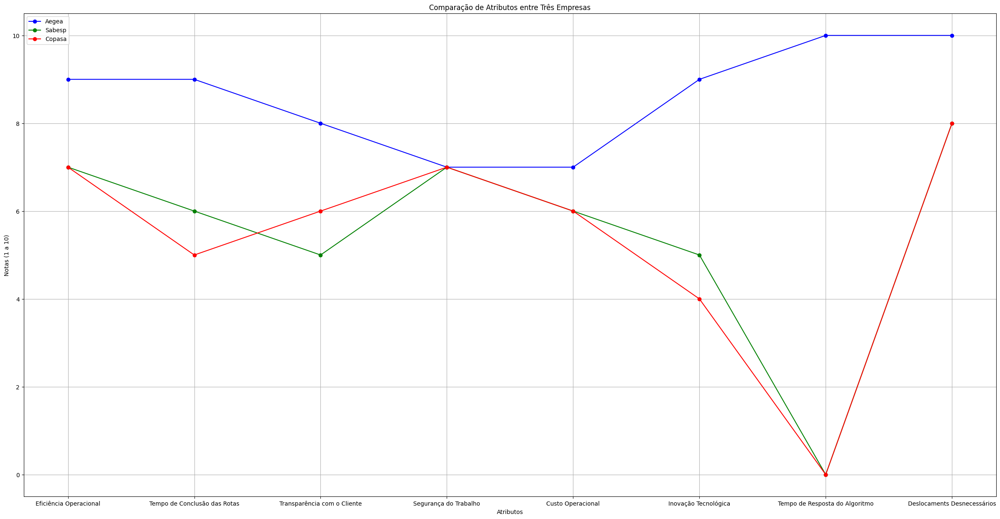
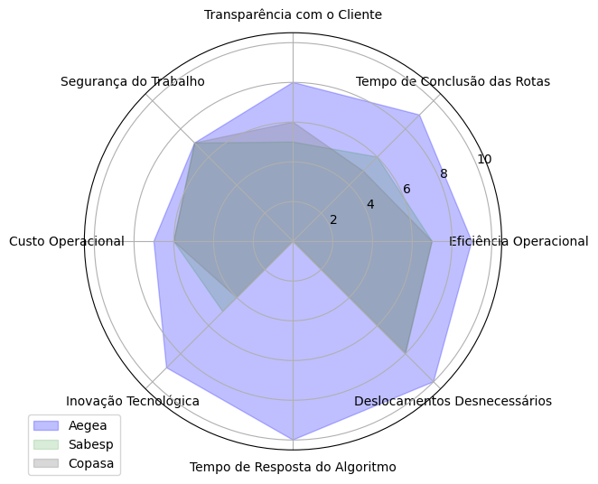
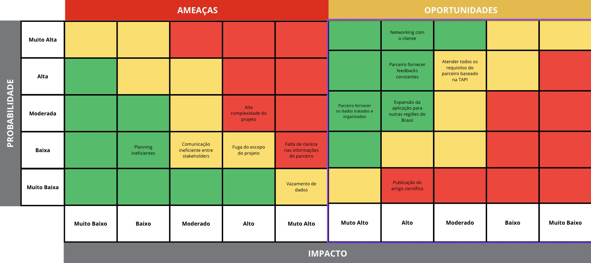
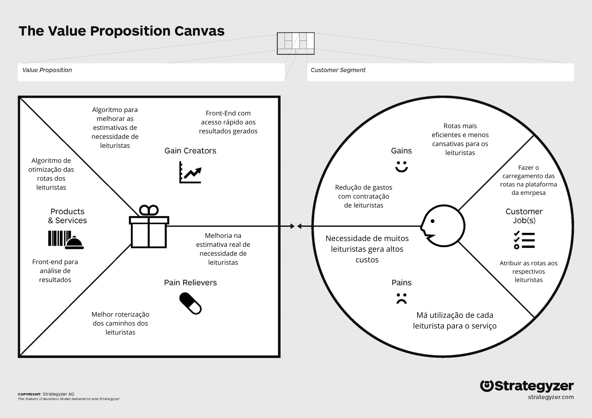

# Entendimento de Negócio: Análise da indústria, parceiro e produto

## 1. Matriz de avaliação de valor Oceano Azul

### 1.1. Introdução:

&emsp;&emsp;A Aegea Saneamento é uma das principais companhias no setor privado de saneamento básico no Brasil, gerenciando uma vasta gama de ativos em diversos estados. A empresa atua através de concessões e parcerias público-privadas para fornecer serviços essenciais de abastecimento de água e tratamento de esgoto. Com uma presença significativa em várias cidades brasileiras, a Aegea é reconhecida por sua excelência operacional e compromisso com a sustentabilidade, implementando rigorosamente práticas que alinham a gestão de recursos hídricos com os princípios de responsabilidade ambiental, social e de governança (ESG). Este comprometimento não só impulsiona sua liderança no mercado como também contribui para a melhoria da qualidade de vida nas regiões em que opera, refletindo-se em reconhecimentos e avaliações positivas tanto no cenário nacional quanto internacional.

&emsp;&emsp;A Matriz de Avaliação de Valor do Oceano Azul é uma ferramenta estratégica inovadora que foi concebida para ajudar as empresas a superar a concorrência ao criar novos espaços de mercado, chamados "Oceanos Azuis", que estão livres de competidores. Esta abordagem, baseada no *best-seller* "A Estratégia do Oceano Azul" de W. Chan Kim e Renée Mauborgne, encoraja as organizações a deixar de competir em mercados saturados — os chamados "Oceanos Vermelhos" — e buscar novas áreas de crescimento que sejam diferenciadas através da inovação em valor. Para isso, a matriz sugere quatro ações estratégicas sobre os atributos do produto ou serviço: Reduzir e Eliminar os atributos que são menos valorizados pelos consumidores ou desnecessários; Aumentar os atributos que são altamente valorizados e estão sub-representados; e Criar novos atributos que nunca foram oferecidos pela indústria. Essas ações são projetadas para simultaneamente impulsionar a inovação e reduzir os custos, criando propostas de valor únicas que atraem e retêm clientes.

&emsp;&emsp;Aplicando esta matriz, a Aegea analisa cuidadosamente oito atributos essenciais para o seu setor:

1. Eficiência Operacional: Este atributo refere-se à capacidade da Aegea de maximizar a produtividade com o mínimo de recursos e tempo. Eficiência operacional em um projeto de leitura de hidrômetros significa reduzir o tempo e os custos associados às rotas, enquanto mantém ou melhora a qualidade das leituras.
2. Tempo de Conclusão das Rotas: Relaciona-se com a rapidez com que as rotas de leitura são completadas. A redução do tempo de conclusão das rotas não só melhora a produtividade, como também influencia diretamente a satisfação do cliente, pois impacta quando e como eles recebem suas contas.
3. Transparência com o Cliente: Este atributo foca na clareza e abertura das comunicações entre a Aegea e seus clientes. Aumentar a transparência pode envolver informar os clientes sobre quando as leituras acontecerão, como os dados são processados, e como as informações afetam suas contas.
4. Segurança do Trabalho: Essencial em operações que envolvem trabalho físico, como a leitura de hidrômetros. Melhorar a segurança do trabalho inclui garantir que os leituristas tenham principalmente uma rota segura, equipamentos adequados, treinamento para lidar com desafios no campo e procedimentos claros para situações de emergência.
5. Custo Operacional: Refere-se aos gastos totais associados às operações de leitura dos hidrômetros. Reduzir custos operacionais pode ser alcançado através da otimização de rotas, uso eficiente de recursos e tecnologias que diminuam a necessidade de deslocamentos frequentes ou repetidos.
6. Inovação Tecnológica: Inclui a adoção de novas tecnologias e práticas inovadoras, como o algoritmo de otimização de rotas e outros dispositivos que podem melhorar a eficiência e a precisão das leituras.
7. Tempo de Resposta do Algoritmo: O tempo de resposta do algoritmo é crucial para a flexibilidade e adaptabilidade das operações. Um algoritmo rápido permite que a Aegea reaja prontamente a mudanças nas condições de trabalho, como tráfego, condições climáticas adversas, ou problemas encontrados durante as rotas.
8. Deslocamentos Desnecessários: Este atributo aborda a importância de eliminar rotas e viagens redundantes ou ineficientes nas operações de leitura de hidrômetros.

&emsp;&emsp;Ademais, as empresas Sabesp e Copasa (Companhia de Saneamento Básico de Minas Gerais) são consideradas fortes concorrentes da Aegea.  A Sabesp, operando no estado de São Paulo, é uma das maiores empresas de saneamento da América Latina, caracterizada por uma grande base de clientes e uma extensa rede de operações. Sua escala e capilaridade conferem uma forte vantagem competitiva em termos de recursos e influência regulatória. Por outro lado, a Copasa, atuando em Minas Gerais, também possui uma posição robusta no mercado, servindo a uma grande população com serviços de água e esgoto.

&emsp;&emsp;Comparativamente, a Aegea, embora seja uma líder no setor privado de saneamento no Brasil, enfrenta o desafio de competir com essas entidades estatais bem-estabelecidas, que possuem longa história e profundas raízes nos mercados locais. A vantagem da Aegea pode residir em sua capacidade de inovar e implementar soluções tecnológicas avançadas mais rapidamente do que suas concorrentes mais burocráticas. Isso permite que a Aegea explore eficientemente novos métodos de otimização e gestão de recursos, visando superar as limitações operacionais que Sabesp e Copasa podem enfrentar devido ao seu tamanho e à inércia institucional. Esta análise de concorrência ajuda a Aegea a posicionar suas inovações estrategicamente, garantindo que ela não apenas atenda, mas exceda as expectativas do mercado em eficiência e satisfação do cliente, criando um valor distinto que diferencia suas operações das práticas estabelecidas pela Sabesp e Copasa.

### 1.2. Ações:

##### Reduzir
- Custo Operacional: A Aegea vem adotando tecnologias avançadas para otimização de rotas e uso eficiente de recursos, o que permite uma redução significativa nos custos operacionais. Em contraste, Sabesp e Copasa ainda dependem mais fortemente de métodos tradicionais e manuais para a leitura de hidrômetros, que envolvem maior uso de mão de obra e recursos, resultando em custos operacionais mais elevados. Logo, a partir do uso de algoritmos e técnicas de otimização avançadas, fica evidente que a Aegea tem tecnologia suficiente para diminuir os custos operacionais associados às rotas de leitura. Isso inclui a implementação de um *software* mais eficiente e a redução de despesas com transporte e mão de obra, contrastando com a dependência de métodos mais tradicionais e custosos pela Sabesp e Copasa. [1]
- Tempo de Conclusão das Rotas: Com a otimização de rotas por algoritmos, a Aegea reduz o tempo de conclusão das rotas, eliminando atrasos desnecessários, enquanto Sabesp e Copasa não possuem processos tão ágeis, resultando em tempos de conclusão mais longos e ineficiências.

##### Eliminar
- Deslocamentos Desnecessários: Utilizando um algoritmo de otimização de rotas, a Aegea consegue eliminar deslocamentos que não agregam valor, como rotas ineficientes que resultam em duplicidade de visitas a uma mesma área. Em contrapartida, Sabesp e Copasa não tem um sistema tão eficiente, resultando em múltiplas visitas às mesmas localidades ou rotas mal planejadas que não otimizam o tempo dos leituristas, aumentando assim os custos de transporte e o tempo de operação.

##### Aumentar
- Eficiência Operacional: A Aegea Saneamento se destaca em eficiência operacional ao incorporar tecnologias avançadas como o *software* de otimização de rotas, permitindo-lhe maximizar a produtividade e minimizar os recursos utilizados. Em contraste, Sabesp e Copasa, operando com métodos mais tradicionais e enfrentando burocracias estatais, tendem a ter operações menos ágeis e mais custosas. A dependência de processos manuais e a lentidão na implementação de inovações resultam em eficiência operacional reduzida para estas empresas, destacando a vantagem competitiva da Aegea no mercado de saneamento brasileiro.
- Transparência com o Cliente: Aegea pode ampliar sua comunicação com os clientes, oferecendo informações detalhadas sobre a leitura de hidrômetros e cobranças de forma proativa. Isto inclui alertas via SMS ou e-mail sobre datas de leitura e explicações claras sobre o cálculo das contas. Sabesp e Copasa, embora possuam processos para informar os clientes, não são tão proativos ou detalhados, limitando-se muitas vezes a comunicados mais gerais e menos personalizados. [2]
- Segurança do Trabalho: Enquanto a Aegea investe em tecnologia para minimizar riscos físicos e garantir a segurança de seus operadores através de melhores equipamentos e treinamentos, Sabesp e Copasa ainda não oferecem o mesmo nível de tecnologia aplicada à segurança no trabalho. A Aegea utiliza dispositivos de segurança avançados e treinamentos frequentes que ajudam a prevenir acidentes, uma prática que pode ser menos intensiva nas outras companhias, além disso, o algoritmo visa reduzir o número de ruas atravessadas pelo leiturista, consequentemente, levando a redução de possíveis acidentes de trabalho. 

##### Criar
- Inovação Tecnológica: A Aegea está na vanguarda da implementação de sistemas que permitem leituras mais precisas e menos invasivas. Isso se contrapõe à Sabesp e à Copasa, que estão mais atrasadas na adoção dessas tecnologias, ainda dependendo em grande parte de leituras manuais, o que aumenta o tempo de operação e a margem de erro.
- Tempo de Resposta do Algoritmo: É necessário criar um algoritmo com um tempo de resposta superior. Esse algoritmo deve ser capaz de recalibrar rapidamente as rotas com base em dados em tempo real. Isso é especialmente crucial, já que Sabesp e Copasa enfrentam desafios de flexibilidade devido a sistemas mais antigos e menos adaptativos. Esses sistemas não recalibram as operações tão prontamente diante de imprevistos ou alterações no ambiente de trabalho.

### 1.3. Matriz Oceano Azul:

Figura 01: Matriz Oceano Azul

Fonte: Material desenvolvido pelos autores (2024)

Figura 02: Matriz Oceano Azul

Fonte: Material desenvolvido pelos autores (2024)

### 1.4. Conclusão:

&emsp;&emsp;Essas iniciativas, quando implementadas de forma eficaz, permitem à Aegea não apenas manter sua liderança como uma das principais empresas de saneamento no Brasil, mas também expandir seu impacto, atingindo novos mercados e comunidades. A estratégia do Oceano Azul proporciona ao projeto e à Aegea a oportunidade de transformar desafios em oportunidades significativas de crescimento e inovação, estabelecendo um legado que vai além da simples prestação de serviços de saneamento, para se tornar um pilar de sustentabilidade e progresso social.

&emsp;&emsp;Em conclusão, ao observar essa Matriz de Avaliação de Valor do Oceano Azul, é notório que a Aegea Saneamento está não apenas seguindo uma estratégia empresarial, mas também reafirmando seu compromisso com uma visão futurista de negócios que equilibra lucratividade com responsabilidade social e ambiental. Esse equilíbrio é essencial para navegar no dinâmico mercado atual e para construir um futuro onde a qualidade de vida e a sustentabilidade andam de mãos dadas.

## 2. Matriz de Risco

&emsp;&emsp;A matriz de riscos e oportunidades é uma ferramenta de gerenciamento de riscos que realiza análises probabilísticas para antecipar potenciais dificuldades e oportunidades que uma empresa pode enfrentar. Ela é representada visualmente por quadrantes que relacionam duas dimensões: "Impacto" e "Probabilidade". Essas dimensões são medidas por uma escala que varia de "muito baixo" a "muito alto".

&emsp;&emsp;Essa matriz é um elemento vital na gestão de projetos e na tomada de decisões estratégicas. Como ferramenta analítica, oferece uma visão clara e quantitativa dos desafios e vantagens potenciais que um projeto ou iniciativa pode encontrar. Isso facilita a identificação e o endereçamento proativo de riscos, enquanto maximiza as oportunidades.

#### **Fundamentação da Matriz de Riscos e Oportunidades**

&emsp;&emsp;A matriz é estruturada com base em duas dimensões críticas:
1. **Impacto**: Refere-se às consequências potenciais que um risco ou oportunidade específico pode trazer para o projeto. Um alto impacto indica um efeito significativo que requer atenção imediata.
2. **Probabilidade**: Avalia a chance de um risco ou oportunidade específica ocorrer. Um valor de probabilidade elevado sinaliza uma maior certeza de ocorrência.

&emsp;&emsp; Ao visualizar os riscos e oportunidades em um plano cartesiano com essas duas dimensões, os gestores podem priorizar e alocar recursos de forma mais eficaz, antecipando desafios e alavancando possíveis vantagens.

<figure>
  <figcaption style="text-align: center;"><b>Figura 03 -</b> Matriz de risco</figcaption>
  
  <figcaption style="text-align: center;">Fonte: Material desenvolvido pelos autores (2024)</figcaption>
</figure>

#### Ameaças e Oportunidades

&emsp;&emsp;Os tópicos listados a seguir permitem uma compreensão mais aprofundada das questões discutidas anteriormente, bem como das razões pelas quais foram avaliados em termos de impacto e probabilidade. A leitura dos pontos deve ser feita de cima para baixo e da esquerda para a direita.

#### Ameaças

1. **_Planning_ ineficiente:** A falta de um planejamento eficiente pode levar a problemas de comunicação, alocação inadequada de recursos e dificuldades na execução das tarefas. A probabilidade disto acontecer é baixa, devido a experiência da equipe e a metodologia de trabalho adotada. O impacto também é baixo já que o acúmulo de tarefas seria temporário e não impediria a entrega dos artefatos.
2. **Comunicação ineficiente entre _stakeholders_:** A comunicação ineficiente entre o grupo e os _stakeholders_ pode acarretar em problemas de alinhamento, atrasos e falta de apoio. A probabilidade de ocorrer é baixa, pois a equipe já possui experiência em projetos e a comunicação é feita de forma clara e objetiva. O impacto é moderado, pois a falta de apoio dos _stakeholders_ pode prejudicar a execução do projeto.
3. **Alta complexidade do projeto:** Devido à complexidade do módulo e do problema apresentado, é possível que nesse primeiro momento, de fato, não seja possível a realização de todo o escopo pedido pelo parceiro, sobretudo em questões técnicas. A probabilidade de ocorrer é moderada, e o impacto é alto, pois a não entrega do escopo completo pode gerar insatisfação do cliente em relação ao projeto.
4. **Fuga do escopo do projeto:** A fuga do escopo do projeto pode ocorrer devido a mudanças de requisitos, falta de controle ou compreensão do escopo, não agradando o cliente. A probabilidade de ocorrer é baixa, pois a equipe passa por diversas validações com o cliente. O impacto é alto, pois a fuga do escopo pode gerar insatisfação do cliente e mais horas de retrabalho.
5. **Falta de clareza nas informações do cliente:** A falta de clareza nas informações do cliente proveniente de dados incompletos ou mal interpretados pode gerar confusão e complexidade na execução do projeto. A probabilidade de ocorrer é baixa, haja vista o intermédio do orientador e do Inteli. O impacto é muito alto, pois a falta de clareza nas informações pode gerar um projeto com funcionalidades erradas e imprecisas.
6. Vazamento de dados: A ausência de medidas adequadas de segurança no armazenamento de dados pode resultar em vazamento de informações confidenciais, comprometendo a reputação da empresa e minando a confiança dos clientes. Embora a probabilidade de ocorrência seja baixa, dada a adoção de boas práticas de segurança pela equipe e o suporte do professor de programação para evitar erros inadvertidos, o impacto potencial é significativamente alto. O vazamento desses dados sensíveis, que incluem informações de clientes, pode acarretar sérias ramificações legais para a empresa.

#### Oportunidades

1. **Parceiro fornecer os dados tratados e organizados:** A possibilidade do parceiro fornecer os dados tratados e organizados pode facilitar a execução do projeto, reduzindo o tempo de desenvolvimento e aumentando a qualidade do produto final. A probabilidade de ocorrer é moderada, uma vez que não é obrigação dele fornecer os dados bem estruturados. O impacto é muito alto, pois a entrega dos dados tratados e organizados acaba facilitando a execução do projeto e uma entrega de maior qualidade.
2. **_Networking_ com o cliente:** A possibilidade de _networking_ com o cliente pode gerar novas oportunidades de negócio e parcerias futuras. A probabilidade de ocorrer é baixa, pois a equipe não tem contato direto com o cliente. O impacto é moderado, pois a possibilidade de _networking_ com o cliente pode gerar novas oportunidades de negócio e parcerias futuras.
3. **Parceiro fornecer _feedbacks_ constantes:** A possibilidade do parceiro fornecer _feedbacks_ constantes pode melhorar a qualidade do produto final e em um bom direcionamento do projeto. A probabilidade de ocorrer é alta, pois temos 5 _sprints_ de validação com o parceiro. O impacto é alto, pois permite que o grupo corrija os rumos do desenvolvimento da solução.
4. **Expansão da aplicação para outras regiões do Brasil:** Atualmente, o projeto engloba uma parte do Rio de Janeiro, mas a expansão para outras regiões do Brasil pode gerar novas oportunidades de negócio. A probabilidade de ocorrer é moderada, pois ao final do projeto, o parceiro pode manifestar interesse em expandir para outras regiões. O impacto é alto, pois permite a expansão do projeto para outras regiões do Brasil.
5. **Publicação do artigo científico:** A possibilidade de publicação do artigo científico pode gerar reconhecimento acadêmico e profissional para a equipe. A probabilidade de ocorrer é baixa, pois isso demandaria trabalho extra por parte dos membros, que já estão engajados em outras atividades.
6.  **Atender todos os requisitos do parceiro baseado na TAPI:** A possibilidade de atender todos os requisitos do parceiro baseado na TAPI pode gerar satisfação do parceiro e uma boa nota acadêmica. A probabilidade de ocorrer é alta, pois as entregas acadêmicas visam atender os requisitos do parceiro. O impacto é moderado, pois é resultado de um bom trabalho e satisfação do cliente.
   
## 3. Canvas Proposta de Valor

&emsp;&emsp;O *Value Proposition Canvas*, ou "Quadro de Proposta de Valor", é uma ferramenta utilizada para desenvolver e analisar propostas de valor em um contexto empresarial. Ele é dividido em 2 partes, o *Customer Profile*, que diz as dores, trabalhos realizados pelo cliente e ganhos que ele terá com a solução; e o *Value Proposition*, que fala sobre os "remediadores" para as dores do cliente, os criadores de ganho da solução e o que ela entrega. Ele é especialmente útil para empreendedores, *startups* e equipes de inovação que desejam compreender melhor as necessidades de seus clientes e como seus produtos ou serviços podem satisfazê-las.[1]

<b>Figura 04 -</b> Canvas Proposta de Valor

Fonte: Material desenvolvido pelos autores (2024)

&emsp;&emsp; Dores: As dores representam os problemas atuais do cliente que eles desejam solucionar/mitigar. São elas a necessidade de muitos leituristas gerar altos custos, devido à alocação e distribuição não tão eficiente da força de trabalho, exigindo muitas contratações extras devido a esse mau uso;

&emsp;&emsp; Trabalhos do cliente: Representam os trabalhos que o cliente atualmente realiza em sua empresa, que no caso atual é fazer o planejamento das rotas dos leituristas na plataforma atual e atribuir as devidas rotas aos seus respectivos leituristas, para que os mesmos consigam vê-las em seu aplicativo;

&emsp;&emsp; Ganhos: Os ganhos representam o que o cliente irá receber como resultado da aplicação da solução desenvolvida pelo grupo. Os ganhos resultantes da aplicação do projeto são de rotas mais eficientes para os leituristas que trabalham para o cliente, melhorando assim a eficiência de trabalho e, consequentemente, a redução de gastos com leituristas devido à melhor utilização dos que já estão contratados;

&emsp;&emsp; Aliviadores de dor: São como o produto entregue alivia/resolve as dores atuais do cliente, que no caso são a melhor roteirização das rotas dos leituristas para resolver problemas de caminhos ruins para os tais e como consequência disso uma melhor estimativa da necessidade de leituristas para assim reduzir gastos com essas contratações;

&emsp;&emsp; Produtos e serviços: Os produtos e serviços representam as funcionalidades que o projeto desenvolvido planeja entregar. Eles são um algoritmo para otimizar as rotas de cada leiturista, de forma a melhorar a eficiência das visitas e um _front-end_ que facilite simulações e a visualização dos resultados gerados;

&emsp;&emsp; Criadores de ganho: São as funcionalidades do projeto que geram algum valor para o cliente. São eles o algoritmo de otimização, que auxilia na roteirização mais eficiente dos leituristas e o _front-end_ que facilita a visualização das informações retornadas pelo algoritmo e aceleram o processo de passagem desses dados para os leituristas.

## 4. Análise financeira do projeto

&emsp;&emsp;A análise financeira do projeto é fundamental para avaliar sua viabilidade e potencial de retorno sobre o investimento [4]. Neste contexto, a *E6eu* desenvolveu uma análise financeira detalhada do projeto de otimização de rotas para leitura de hidrômetros, considerando os custos, benefícios e impactos econômicos associados à implementação do algoritmo de otimização de rotas. A seguir, são apresentados os principais aspectos da análise financeira do projeto:

### 4.1. Economia de tempo e dinheiro:

**Cenário Atual:**

&emsp;&emsp;Antes da implementação do projeto de otimização de rotas para leitura de hidrômetros, o processo caracteriza-se por rotas ineficientes, resultando em um alto consumo de tempo e recursos. 
- **Tempo de conclusão das rotas:** Atualmente, o tempo médio de conclusão das rotas é de 7 horas, com uma efetividade de 80% na leitura.
- **Produtividade dos leituristas:** A produtividade atual é de 354 ligações por rota, com um tempo médio de 3 minutos entre leituras.
- **Custos operacionais:** Os custos operacionais associados às leituras de hidrômetros são significativos, devido à necessidade de deslocamentos frequentes, _smartphones_, impressoras térmicas e bobinas de papel. Além disso, cada leiturista tem um custo médio de 6 mil reais, incluindo salários, encargos e benefícios. 

**Cenário Futuro:**

&emsp;&emsp;Com a introdução do algoritmo de otimização de rotas, a Aegea Saneamento poderá reduzir significativamente o tempo necessário para completar as rotas, eliminando deslocamentos desnecessários e aumentando a produtividade dos leituristas. Isso resultará em uma economia substancial de tempo e dinheiro, reduzindo os custos operacionais associados às leituras de hidrômetros e melhorando a eficiência geral do processo.

- **Tempo de conclusão das rotas:** Espera-se que o tempo médio de conclusão das rotas seja de 6 horas.
- **Produtividade dos leituristas:** Espera-se que o tempo médio de leitura seja reduzido para 2 minutos.
- **Custos operacionais:** Com a otimização das rotas, espera-se uma redução significativa nos custos operacionais, devido à menor necessidade de deslocamentos e ao uso eficiente de recursos. Além disso, a eficiência operacional resultante do algoritmo de otimização de rotas permitirá uma melhor alocação da força de trabalho, reduzindo a necessidade de contratações extras e otimizando o uso dos leituristas existentes.

**Estimativa de Economia:**

&emsp;&emsp;Para uma estimativa aproximada de economia, considerando que a otimização das rotas resulte em uma redução de 10% no tempo de leitura e no tempo de conclusão. Se cada leiturista custa R$6.000,00 por 8 horas de trabalho (6h de leitura e 2h de deslocamento), uma redução de 10% no tempo de trabalho resultaria em uma economia de R$600,00 por leiturista. Com 400 leituristas, isso resultaria em uma economia de, aproximadamente, R$240.000,00 por mês.

&emsp;&emsp;É válido ressaltar que esses valores são estimativas e podem variar de acordo com a eficácia da implementação do projeto. No entanto, eles fornecem uma visão geral dos benefícios potenciais que a otimização de rotas pode trazer para a concessionária Águas do Rio.

### 4.2. Aumento da produtividade dos leituristas:

&emsp;&emsp;Após a implementação do projeto de otimização, estima-se mudanças significativas nas métricas operacionais:

- Atualmente, cada leiturista lê 354 ligações em 7 horas, com um tempo médio de 3 minutos entre cada leitura. Isso significa que cada leiturista lê aproximadamente 140 ligações por hora (420 minutos / 3 minutos).
- Se o tempo médio entre cada leitura for reduzido para 2 minutos, então cada leiturista poderá ler mais ligações por hora. Especificamente, eles poderiam ler 180 ligações por hora (360 minutos / 2 minutos).
- Além disso, se o tempo médio de conclusão for reduzido para 6 horas, então o número total de ligações que cada leiturista pode ler em um dia seria de 1080 ligações (180 ligações por hora * 6 horas).

&emsp;&emsp;Portanto, com a implementação do modelo de otimização de rotas proposto pela *E6eu*, a produtividade aumentaria para 1080 ligações por rota, e o número total de rotas necessárias seria reduzido.

### 4.3. Custos do projeto:

&emsp;&emsp;O investimento previsto para o projeto inclui despesas relacionadas ao desenvolvimento da equipe, aquisição de tecnologias e equipamentos necessários para o desenvolvimento dos algoritmos de otimização de rotas, além da manutenção e operação do sistema. As principais despesas no período de um ano são:

- **Desenvolvimento da Equipe:** De acordo com a Glassdoor, o salário médio de um desenvolvedor _full-stack_ júnior no Brasil é de R$3.263,00 por mês [5]. Logo, considerando uma equipe de 6 membros, o custo total para o período de 10 semanas (46 dias úteis) é de R$40.936,00. Considerando encargos sociais e benefícios (INSS e FGTS), o custo total é de R$52.398,08. [6] 
- **Integração com o Sistema Existente e Manutenção:** O custo de integração com o sistema existente e manutenção do sistema é estimado em R$70.940,00 por 7 meses de trabalho (218 dias úteis no ano), visto que, deve-se subtrair o período de desenvolvimento do projeto. Portanto, essa tarefa seria desempenhada por um desenvolvedor pleno que, segundo a Glassdoor 2024, tem um salário médio de R$7.159,00 por mês, já considerando encargos sociais e benefícios. [7] 
- **Hospedagem do Sistema:** 
  * Instância EC2: Suponha a utilização de uma instância do tipo t2.micro, que é uma instância de baixo custo. O custo mensal dessa instância na região da América do Norte (N. Virginia) é de aproximadamente $8,50.
  * Armazenamento: Armazenamento adicional para o banco de dados e outros arquivos. O custo do armazenamento de 1TB na região da América do Norte (N. Virginia) é de aproximadamente $23,00.
  * Transferência de Dados: O custo de transferência de dados para uma média de 100 usuários mensais é de $20,00 para transferência de dados.
  * Total: O custo total para hospedagem do sistema é de $385,00 por 10 meses (desconsiderando 2 meses de desenvolvimento), equivalemdo a aproximadamente R$2.040,00.
  
&emsp;&emsp;**Observação:** Por se tratar de um projeto interno, não existindo vendas, não há previsão de receitas.

&emsp;&emsp;Portanto, infere-se que, o montante total estimado pela Águas do Rio para o projeto, no período de um ano, é de até R$125.378,00 visando a implementação do MVP (_Minimum Viable Product_) necessário para alcançar os objetivos estabelecidos. Esse investimento é crucial para garantir o sucesso do projeto e proporcionar uma base sólida para melhorias contínuas e expansão futura.

## 5. Referências

[1] GUSHIKEN, Amanda. "Value Proposition Canvas: o que é e como funciona essa metodologia?". G4 Educação. 26 de Julho de 2023. Disponível em: [G4 Educação](https://g4educacao.com/portal/value-proposition-canvas). Acesso em: 19 abr. 2024.

[2] Sabesp e Copasa. "Saneamento básico: Início de cobertura de Sanepar com Compra; Sabesp e Copasa com Neutro". Disponível em: [EXPERT XP](https://conteudos.xpi.com.br/acoes/relatorios/saneamento-basico-inicio-de-cobertura-de-sanepar-com-compra-sabesp-e-copasa-com-neutro/). Acesso em: 22 abr. 2024.

[3] Copasa. "Copasa em Movimento". Disponível em: [Copasa](https://www.copasa.com.br/wps/portal/internet/a-copasa/copasa-em-movimento/!ut/p/z1/rZJNb8IwDIZ_yw4cI7uj0HIsSLSlAyYmPprLlKUZZFqTQgP7-PVzEbuNTpOWix3ltV_nSYDDBrgRJ70VTlsjXmmf8_7jHWZRkmU4mS_SMUbZYh7P0-EimHmwPgvwyooQOB3fYzry_BgnYYIhRmHgDZIRdnv-d32LgLf7r4ADr6QuIO8V6kl6smAhBeZTygb9fsG6wvdlL1CBH6hGLY2r3A7yWjvFpK1ELSgYp46FrTuoKTsY5Zqsdtod5RlFB8VF3MFLkSpZaU-6VMbZy0VaJuXtnNbNaO2SnCyCqxZjgnnS6g2Wxh5KeruHP6JJECa_4ab_cHuYjqZb6izcjmnzbGHzEw9S6pf9nkcEvIH77mDzv8Srcrksw-4HM5_DGYvXYR3dfAHHaO1F/dz/d5/L2dBISEvZ0FBIS9nQSEh/?urile=wcm%3Apath%3A%2Fsite-copasa-conteudos%2Finternet%2Finstitucional%2Fa-copasa%2Fcopasa-em-movimento). Acesso em: 22 abr. 2024.

[4] Contabilizei. "O que é ROI: como calcular retorno sobre o investimento?". Disponível em: [Contabilizei](https://www.contabilizei.com.br/contabilidade-online/o-que-e-roi-como-calcular-retorno-sobre-o-investimento/). Acesso em: 25 abr. 2024.

[5] Gassdoor. "Salários do cargo de Desenvolvedor Full Stack Júnior - Brasil". Disponível em: [Glassdoor](https://www.glassdoor.com.br/Sal%C3%A1rios/desenvolvedor-full-stack-j%C3%BAnior-sal%C3%A1rio-SRCH_KO0,31.htm). Acesso em 25 de abr. 2024.

[6] Gassdoor. "Salários do cargo de Desenvolvedor Pleno - Brasil". Disponível em: [Glassdoor](https://www.glassdoor.com.br/Sal%C3%A1rios/desenvolvedor-pleno-sal%C3%A1rio-SRCH_KO0,19.htm). Acesso em 25 de abr. 2024.

[7] O Antagonista. "Entenda os descontos no seu salário: INSS, FGTS e Imposto de Renda explicados". Disponível em: [O Antagonista](https://oantagonista.com.br/brasil/entenda-os-descontos-no-seu-salario-inss-fgts-e-imposto-de-renda-explicados/#:~:text=O%20FGTS%20%C3%A9%20depositado%20mensalmente,do%20contracheque%20pelo%20Receita%20Federal.). Acesso em: 25 de abr. 2024.