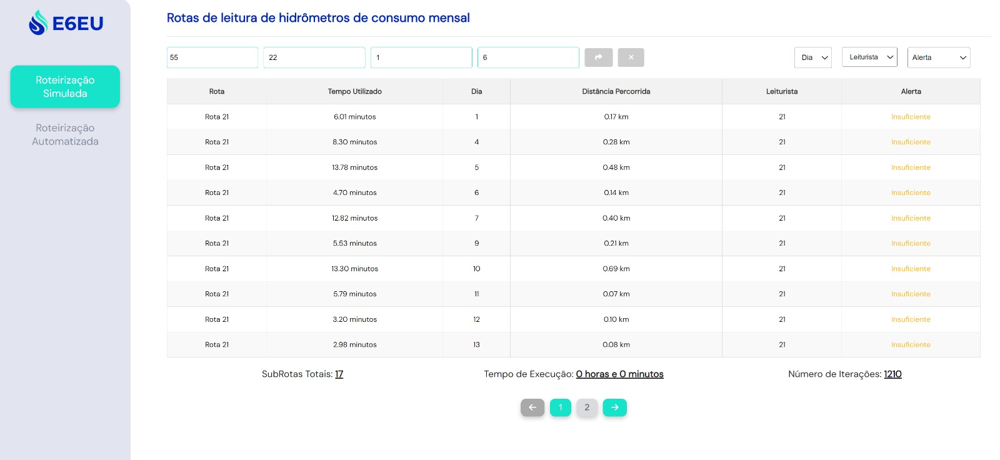
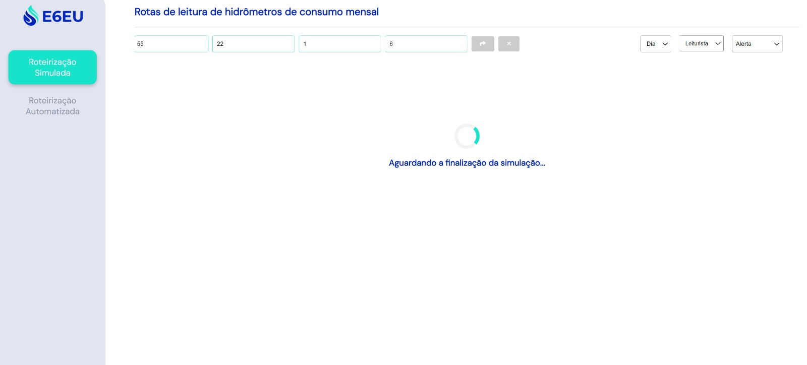
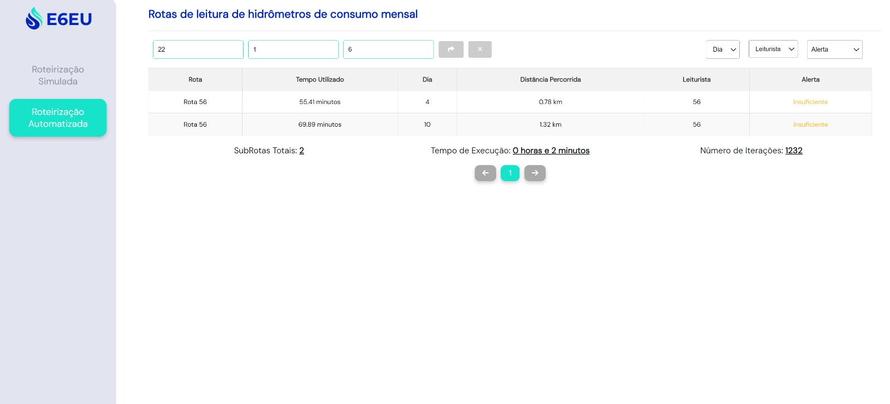
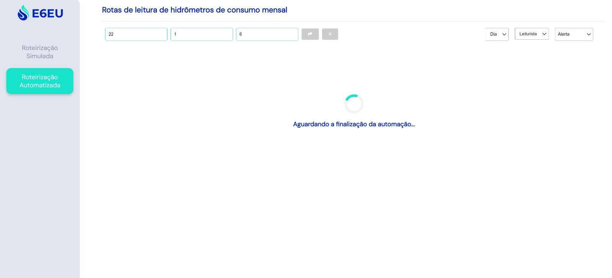

# Descrição dos Testes da Aplicação

&emsp;&emsp;Este documento descreve os testes realizados na aplicação **E6eu**. Os testes podem ser feitos manualmente por um operador humano, utilizando dados de entrada previamente conhecidos e verificando se a resposta da aplicação coincide com a resposta esperada.

## Introdução

&emsp;&emsp;A aplicação foi testada manualmente com vários conjuntos de dados de entrada conhecidos. Para cada conjunto de dados, a resposta da aplicação foi comparada com a resposta esperada. Os resultados dos testes estão descritos nas seções seguintes.

## Descrição dos Testes realizados no [Postman](https://www.postman.com/)

&emsp;&emsp;Sendo o sistema escolhido para a realização dos testes da API **E6eu**, o [Postman](https://www.postman.com/) é uma plataforma de colaboração para desenvolvimento de APIs (_Application Programming Interfaces_) que permite aos desenvolvedores projetar, testar e documentar APIs de maneira eficiente [1]. Para facilitar a realização dos testes, há uma [coleção do projeto](https://speeding-meteor-26896.postman.co/workspace/New-Team-Workspace~dbc2dfef-7156-4920-97f0[…]4e70-85d0-fe344defdcad?action=share&creator=33784019) disponível. Esta coleção agrupa todas as requisições necessárias para testar os diferentes endpoints da API de forma organizada e automatizada. Com essa coleção, é possível simular as diversas interações com a API, validar as respostas recebidas, e garantir que o comportamento da API esteja conforme o esperado. 

&emsp;&emsp;Lembre-se de que, para a realização dos testes, é necessário que o back-end esteja rodando localmente. Para isso, siga as instruções fornecidas no arquivo `artefatos\instrucoes_backend.md` disponível neste repositório. Para realizar os testes diretamente na _interface_ (_front-end_) da API siga o passo a passo descrito no arquivo `artefatos\instrucoes_api.md`. Para agilizar os testes, você pode editar o arquivo `codigo\backend\app\algorithms\walker.py`. Nas linhas 148 e 152, modifique o campo `df = df.head(40)`. Esta alteração reduz o tamanho do _DataFrame_ utilizado, permitindo testes mais rápidos. Caso queira rodar o processo completo, basta comentar ou remover essas linhas de código, permitindo que o _DataFrame_ seja processado em sua totalidade.
 
### Teste 1 - Teste de Verificação de Funcionamento Básico

**Descrição:** Verificar se a aplicação está rodando e respondendo a requisições na URL principal.

**Dados de Entrada:**
- Método: GET
- URL: `http://localhost:5000/`

**Passos para Execução:**
1. Abrir o Postman.
2. Configurar uma requisição GET para a URL `http://localhost:5000/`.
3. Enviar a requisição.

**Resultado Esperado:**
- A resposta deve ter o status HTTP 200 (OK).
- O corpo da resposta deve conter uma mensagem indicando que a aplicação está funcionando, por exemplo:
  ```json
  {
    "mensagem": "Bem-vindo à API de otimização de rotas E6eu!"
  }
  ```

**Resultado Obtido:**
- Status HTTP: [x] 200 OK [ ] Outro
- Corpo da resposta:
  ```json
  {
    "mensagem": "Bem-vindo à API de otimização de rotas E6eu!"
  }
  ```
- [x] Passou
- [ ] Falhou

<div align="center">
<sup><b>Figura 01 -</b> Página Inicial da API **E6eu**</sup>


<sub>Fonte: Material desenvolvido pelos autores (2024)</sub>
</div>


### Teste 2 - Teste de Verificação de Upload sem Arquivo Anexado

**Descrição:** Verificar se a aplicação responde adequadamente quando uma requisição de upload é feita sem nenhum arquivo anexado.

**Dados de Entrada:**
- Método: POST
- URL: `http://localhost:5000/upload`
- Não anexar arquivo.

**Passos para Execução:**
1. Abrir o Postman.
2. Configurar uma requisição POST para a URL `http://localhost:5000/upload`.
3. Enviar a requisição.

**Resultado Esperado:**
- A resposta deve ter o status HTTP 400 (Bad Request).
- O corpo da resposta deve conter uma mensagem indicando que nenhum arquivo foi selecionado, por exemplo:
  ```json
  {
    "erro": "Arquivo não selecionado",
    "mensagem": "Falha no upload do arquivo"
  }
  ```

**Resultado Obtido:**
- Status HTTP: [x] 400 Bad Request [ ] Outro
- Corpo da resposta:
  ```json
  {
    "erro": "Arquivo não selecionado",
    "mensagem": "Falha no upload do arquivo"
  }
  ```
- [x] Passou
- [ ] Falhou

### Notas Adicionais

- A _interface_ visual não permite que nenhum arquivo seja anexado.

### Teste 3 - Teste de Verificação do Upload de um Arquivo que não é CSV

**Descrição:** Verificar se a aplicação sinaliza adequadamente quando um arquivo que não é CSV é carregado.

**Dados de Entrada:**
- Método: POST
- URL: `http://localhost:5000/upload`
- Na aba "Body", selecionar "form-data".
- Adicionar um campo "file" e carregar um arquivo não-CSV (por exemplo, uma imagem `.png`). Obs: A imagem utilizada nesse teste está localizada no repositório no seguinte caminho: `artefatos/imagens/automatizada.png`.

**Passos para Execução:**
1. Abrir o Postman.
2. Configurar uma requisição POST para a URL `http://localhost:5000/upload`.
3. Na aba "Body", selecionar "form-data".
4. Adicionar um campo "file" e carregar a imagem `automatizada.png`.
5. Enviar a requisição.

**Resultado Esperado:**
- A resposta deve ter o status HTTP 400 (Bad Request).
- O corpo da resposta deve conter uma mensagem indicando que o tipo de arquivo não é permitido, por exemplo:
  ```json
  {
    "erro": "Tipo de arquivo não permitido",
    "mensagem": "Falha no upload do arquivo"
  }
  ```

**Resultado Obtido:**
- Status HTTP: [x] 400 Bad Request [ ] Outro
- Corpo da resposta:
  ```json
  {
    "erro": "Tipo de arquivo não permitido",
    "mensagem": "Falha no upload do arquivo"
  }
  ```
- [x] Passou
- [ ] Falhou
  
### Notas Adicionais

- A _interface_ visual não permite o anexo de um arquivo que não seja `.csv`.

### Teste 4 - Teste de Verificação do Upload com Arquivo CSV sem Todas as Colunas Necessárias

**Descrição:** Verificar se a aplicação responde adequadamente quando o arquivo CSV de entrada não contém todas as colunas esperadas.

**Dados de Entrada:**
- Método: POST
- URL: `http://localhost:5000/upload`
- Na aba "Body", selecionar "form-data".
- Adicionar um campo "file" e carregar o arquivo CSV de teste com colunas diferentes do esperado. Obs: O arquivo utilizado nesse teste está localizado no repositório no seguinte caminho: `codigo/database/AMOSTRA_MENOR_TESTE.csv`, o qual não contém as colunas `LOGRADOURO` e `NUMERO`.

**Passos para Execução:**
1. Abrir o Postman.
2. Configurar uma requisição POST para a URL `http://localhost:5000/upload`.
3. Na aba "Body", selecionar "form-data".
4. Adicionar um campo "file" e carregar o arquivo `AMOSTRA_MENOR_TESTE.csv`.
5. Enviar a requisição.

**Resultado Esperado:**
- A resposta deve ter o status HTTP 400 (Bad Request).
- O corpo da resposta deve conter uma mensagem indicando quais colunas estão faltando no arquivo CSV anexado, por exemplo:
  ```json
  {
    "erro": "Colunas ausentes: LOGRADOURO, NUMERO",
    "mensagem": "Falha no upload do arquivo"
  }
  ```

**Resultado Obtido:**
- Status HTTP: [x] 400 Bad Request [ ] Outro
- Corpo da resposta:
  ```json
  {
    "erro": "Colunas ausentes: LOGRADOURO, NUMERO",
    "mensagem": "Falha no upload do arquivo"
  }
  ```
- [x] Passou
- [ ] Falhou

<div align="center">
<sup><b>Figura 02 -</b> Estado da _interface_ visual com erro de "colunas faltantes"</sup>


<sub>Fonte: Material desenvolvido pelos autores (2024)</sub>
</div>

### Teste 5 - Teste de Verificação do Upload de um Arquivo CSV Válido

**Descrição:** Verificar se a aplicação processa corretamente o upload de um arquivo CSV válido e retorna uma resposta adequada.

**Dados de Entrada:**
- Método: POST
- URL: `http://localhost:5000/upload`
- Na aba "Body", selecionar "form-data".
- Adicionar um campo "file" e carregar o arquivo CSV com os dados do cliente com todas as colunas esperadas, sendo elas: `INDICE; LATITUDE; LONGITUDE; CODIGO_ROTA; SEQUENCIA; LOGRADOURO; NUMERO`. Obs: O arquivo utilizado nesse teste está localizado no repositório no seguinte caminho: `codigo/database/AMOSTRA_TOTAL.csv`.

**Passos para Execução:**
1. Abrir o Postman.
2. Configurar uma requisição POST para a URL `http://localhost:5000/upload`.
3. Na aba "Body", selecionar "form-data".
4. Adicionar um campo "file" e carregar o arquivo `AMOSTRA_TOTAL.csv`.
5. Enviar a requisição.

**Resultado Esperado:**
- A resposta deve ter o status HTTP 200 (OK).
- O corpo da resposta deve conter uma mensagem indicando que o arquivo foi processado com sucesso, por exemplo:
  ```json
  {
    "mensagem": "Arquivo enviado e processado com sucesso",
    "resultados": "Arquivo salvo como AMOSTRA_TOTAL.csv"
  }
  ```

**Resultado Obtido:**
- Status HTTP: [x] 200 OK [ ] Outro
- Corpo da resposta:
  ```json
  {
    "mensagem": "Arquivo enviado e processado com sucesso",
    "resultados": "Arquivo salvo como AMOSTRA_TOTAL.csv"
  }
  ```
- [x] Passou
- [ ] Falhou

### Teste 6 - Teste de Verificação da Execução do "Algoritmo de Roteirização Simulada"

**Descrição:** Verificar se a aplicação executa corretamente o "Algoritmo de Roteirização Simulada" com os parâmetros fornecidos.

**Dados de Entrada:**
- Método: POST
- URL: `http://localhost:5000/start_automation`
- Body (JSON):
  ```json
  {
    "select_algo": 0,
    "readers": 12,
    "time_readings": 1,
    "hours_work": 6,
    "total_days": 22
  }
  ```

**Passos para Execução:**
1. Abrir o Postman.
2. Configurar uma requisição POST para a URL `http://localhost:5000/start_simulation`.
3. Na aba "Body", selecionar "raw" e escolher "JSON" como tipo de conteúdo.
4. Inserir o seguinte JSON no body da requisição:
   ```json
   {
     "select_algo": 0,
     "readers": 12,
     "time_readings": 1,
     "hours_work": 6,
     "total_days": 22
   }
   ```
5. Enviar a requisição.

**Resultado Esperado:**
- A resposta deve ter o status HTTP 200 (OK).
- O corpo da resposta deve conter uma mensagem indicando que a tarefa foi submetida com sucesso, por exemplo:
  ```json
  {
    "message": "Task submitted!"
  }
  ```

**Resultado Obtido:**
- Status HTTP: [x] 200 OK [ ] Outro
- Corpo da resposta:
  ```json
  {
    "message": "Task submitted!"
  }
  ```
- [x] Passou
- [ ] Falhou

<div align="center">
<sup><b>Figura 03 -</b> Algoritmo Simulado</sup>


<sub>Fonte: Material desenvolvido pelos autores (2024)</sub>
</div>

  
### Teste 7 - Teste de Verificação do _status_ do "Algoritmo de Roteirização Simulada"

**Descrição:** Verificar se a aplicação executa corretamente o "Algoritmo de Roteirização Simulada" com os parâmetros fornecidos.

**Dados de Entrada:**
- Método: GET
- URL: `http://localhost:5000/simulation_status`

**Passos para Execução:**
1. Abrir o Postman.
2. Configurar uma requisição POST para a URL `http://localhost:5000/simulation_status`.
3. Enviar a requisição.

**Resultado Esperado:**
- A resposta deve ter o status HTTP 200 (OK).
- O corpo da resposta deve conter uma mensagem indicando o status da execução do algoritmo, por exemplo:

Resposta gerada quando o algoritmo está em execução:
  ```json
    {
        "result": null,
        "state": "running"
    }
  ```

Resposta gerada quando o algoritmo finalizou a execução:
  ```json
{
    "result": "tempo de execução",
    "state": "finished"
}
  ```

**Resultado Obtido:**
- Status HTTP: [x] 200 OK [ ] Outro
- Corpo da resposta:
  ```json
    {
        "result": 0.20016190608342488,
        "state": "finished"
    }
  ```
- [x] Passou
- [ ] Falhou

<div align="center">
<sup><b>Figura 05 -</b> Tela de Load durante a execução do algoritmo simulado</sup>


<sub>Fonte: Material desenvolvido pelos autores (2024)</sub>
</div>

### Teste 8 - Teste de Verificação da Execução do "Algoritmo de Roteirização Automatizado"

**Descrição:** Verificar se a aplicação executa corretamente o "Algoritmo de Roteirização Automatizado" com os parâmetros fornecidos.

**Dados de Entrada:**
- Método: POST
- URL: `http://localhost:5000/start_automation`
- Body (JSON):
  ```json
  {
    "select_algo": 1,
    "readers": 12,
    "time_readings": 1,
    "hours_work": 6,
    "total_days": 22
  }
  ```

**Passos para Execução:**
1. Abrir o Postman.
2. Configurar uma requisição POST para a URL `http://localhost:5000/start_automation`.
3. Na aba "Body", selecionar "raw" e escolher "JSON" como tipo de conteúdo.
4. Inserir o seguinte JSON no body da requisição:
   ```json
   {
     "select_algo": 1,
     "readers": 12,
     "time_readings": 1,
     "hours_work": 6,
     "total_days": 22
   }
   ```
5. Enviar a requisição.

**Resultado Esperado:**
- A resposta deve ter o status HTTP 200 (OK).
- O corpo da resposta deve conter uma mensagem indicando que a tarefa foi submetida com sucesso, por exemplo:
  ```json
  {
    "message": "Task submitted!"
  }
  ```

**Resultado Obtido:**
- Status HTTP: [x] 200 OK [ ] Outro
- Corpo da resposta:
  ```json
  {
    "message": "Task submitted!"
  }
  ```
- [x] Passou
- [ ] Falhou

<div align="center">
<sup><b>Figura 04 -</b>Algoritmo automatizado</sup>


<sub>Fonte: Material desenvolvido pelos autores (2024)</sub>
</div>

### Notas Adicionais

- Também foram realizados testes com a ausência de cada um dos parâmetros de entrada individualmente. Verificou-se que o algoritmo ainda é executado, pois há valores padrão definidos para os parâmetros de entrada.
- Importante: Mesmo com a presença de valores padrão, é necessário incluir um JSON, mesmo que vazio, no corpo da requisição ("raw") para que o algoritmo seja executado corretamente.

### Teste 9 - Teste de Verificação do _status_ do "Algoritmo de Roteirização Automatizada"

**Descrição:** Verificar se a aplicação executa corretamente o "Algoritmo de Roteirização Simulada" com os parâmetros fornecidos.

**Dados de Entrada:**
- Método: GET
- URL: `http://localhost:5000/automation_status`

**Passos para Execução:**
1. Abrir o Postman.
2. Configurar uma requisição POST para a URL `http://localhost:5000/automation_status`.
3. Enviar a requisição.

**Resultado Esperado:**
- A resposta deve ter o status HTTP 200 (OK).
- O corpo da resposta deve conter uma mensagem indicando o status da execução do algoritmo, por exemplo:

Resposta gerada quando o algoritmo está em execução:
  ```json
    {
        "result": null,
        "state": "running"
    }
  ```

Resposta gerada quando o algoritmo finalizou a execução:
  ```json
{
    "result": "<tempo_de_execucao>",
    "state": "finished"
}
  ```

**Resultado Obtido:**
- Status HTTP: [x] 200 OK [ ] Outro
- Corpo da resposta:
  ```json
    {
        "result": 1.3137498855590821,
        "state": "finished"
    }
  ```
- [x] Passou
- [ ] Falhou

<div align="center">
<sup><b>Figura 05 -</b> Tela de Load durante a execução do algoritmo automatizado</sup>


<sub>Fonte: Material desenvolvido pelos autores (2024)</sub>
</div>

### Teste 10 - Teste de Verificação do retorno detalhado dos algoritmos

**Descrição:** Verificar se a aplicação executa corretamente o "Algoritmo de Roteirização Automatizada" com os parâmetros fornecidos e retorna os dados detalhados da roteirização.

**Dados de Entrada:**
- Método: GET
- URL: `http://localhost:5000/detailed-data`

**Passos para Execução:**
1. Abrir o Postman.
2. Configurar uma requisição GET para a URL `http://localhost:5000/detailed-data`.
3. Enviar a requisição.

**Resultado Esperado:**
- A resposta deve ter o status HTTP 200 (OK).
- O corpo da resposta deve conter um JSON com os detalhes da roteirização gerada pelos algoritmos.

Exemplo das primeiras linhas da resposta:
```json
[
    {
        "destino": "MINISTRO EDGARD ROMERO, 679",
        "destino_latitude": -22.861608,
        "destino_longitude": -43.332514,
        "dia": "4",
        "distancia": "0.0",
        "leiturista": "56",
        "origem": "MINISTRO EDGARD ROMERO, 679",
        "origem_latitude": -22.861608,
        "origem_longitude": -43.332514,
        "tempo": "1.00 minutos"
    }
]
```

**Resultado Obtido:**
- Status HTTP: [x] 200 OK [ ] Outro
- O corpo da resposta pode ser acessado na pasta de outputs:
    ```json
    [
        {
            "destino": "MINISTRO EDGARD ROMERO, 679",
            "destino_latitude": -22.861608,
            "destino_longitude": -43.332514,
            "dia": "4",
            "distancia": "0.0",
            "leiturista": "56",
            "origem": "MINISTRO EDGARD ROMERO, 679",
            "origem_latitude": -22.861608,
            "origem_longitude": -43.332514,
            "tempo": "1.00 minutos"
        }
    ]
    ```
- [x] Passou
- [ ] Falhou
  
### Notas Adicionais

- As respostas geradas no corpo dessa URL são extensas, por isso foi adicionado apenas um exemplo. Para visualizar o arquivo `JSON` com a resposta completa, siga os passos descritos acima no Postman. Além disso, os _outputs_ gerados são salvos localmente em: `codigo/backend/app/output/detailed_data.json`.

### Teste 11 - Teste de Verificação do retorno sumarizado dos algoritmos 

**Descrição:** Verificar se a aplicação executa corretamente o "Algoritmo de Roteirização Automatizada" com os parâmetros fornecidos e retorna os dados sumarizados da roteirização.

**Dados de Entrada:**
- Método: GET
- URL: `http://localhost:5000/summary-data`

**Passos para Execução:**
1. Abrir o Postman.
2. Configurar uma requisição GET para a URL `http://localhost:5000/summary-data`.
3. Enviar a requisição.

**Resultado Esperado:**
- A resposta deve ter o status HTTP 200 (OK).
- O corpo da resposta deve conter um JSON com o resumo da roteirização gerada pelos algoritmos.

&emsp;&emsp;Exemplo das primeiras linhas da resposta:
```json
    [
        {
            "rota": "Rota 56",
            "dia": "4",
            "tempo": "55.41 minutos",
            "distancia": "0.78 km",
            "leiturista": "56",
            "alerta": "Insuficiente"
        },
        {
            "rota": "Rota 56",
            "dia": "10",
            "tempo": "69.89 minutos",
            "distancia": "1.32 km",
            "leiturista": "56",
            "alerta": "Insuficiente"
        }
    ]
```

**Resultado Obtido:**
- Status HTTP: [x] 200 OK [ ] Outro
- O corpo da resposta pode ser acessado na pasta de outputs:
    ```json
    [
        {
            "rota": "Rota 56",
            "dia": "4",
            "tempo": "55.41 minutos",
            "distancia": "0.78 km",
            "leiturista": "56",
            "alerta": "Insuficiente"
        },
        {
            "rota": "Rota 56",
            "dia": "10",
            "tempo": "69.89 minutos",
            "distancia": "1.32 km",
            "leiturista": "56",
            "alerta": "Insuficiente"
        }
    ]
    ```
- [x] Passou
- [ ] Falhou
  
## Conclusão

&emsp;&emsp;Os testes realizados cobrem cenários básicos de uso da aplicação **E6eu**, incluindo operações simples e manipulação de entradas inválidas. A execução desses testes deve garantir que a aplicação funcione conforme esperado em situações comuns e lide adequadamente com entradas errôneas.

---

Nome: Isabelle da Silva Santos
<br>
Data: 09 de junho de 2024.

## Referências

[1] Postman. "_What is Postman?_". Disponível em: [Postman](https://www.postman.com/home). Acesso em: 09 de jun. de 2024.